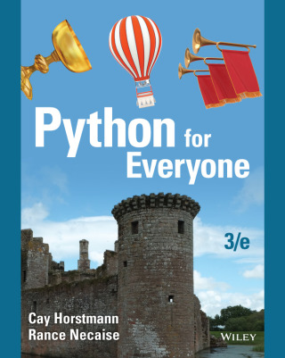
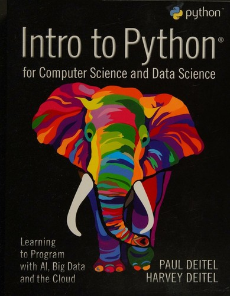
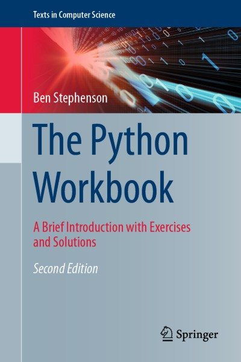

# 🐍 DSAI1003 – Fundamental Programming Concepts in Python

🌐 **Language:** [🇻🇳 Vietnamese Version (index-vn.md)](index-vn.md) | 🇬🇧 **English**

> **Lecturer:** Dr. Vu Duc Minh  
> **Faculty:** Faculty of Data Science & Artificial Intelligence, School of Technology, National Economics University (NEU)  
> **Program:** Data Science in Finance and E-commerce (DSFE)  
> **Credits:** 3 Credits (45h Lectures + 22.5h Practical Tutorials (option), 90h Self-study)  
> **Syllabus:** See [syllabus-en.md](syllabus-en.md) | [syllabus-vn.md](syllabus-vn.md)

---

## 🚀 Learning Methodology & Course Guides

| Document / Guide | Format / Link |
| :--- | :---: |
| 📘 **Course Handbook & Self-Study Guide** (Handbook A4, 11 pages) | [**Download PDF**](lectures/part00-starting-points/python_course_guide-en.pdf ':ignore target=_blank') |
| 🖥️ **Course Presentation Slides** (Beamer 16:9, 26 slides) | [**Download Slides PDF**](lectures/part00-starting-points/python_course_guide_slides-en.pdf ':ignore target=_blank') |
| 📖 **How to Self-Study Python Effectively** (Tutorial/Lab) | [**Read Tutorial**](lectures/part00-starting-points/tutorial-effective-python-self-study-en.md) |
| 🤖 **Strategic AI (ChatGPT) Assisted Learning** (Tutorial/Lab) | [**Read Tutorial**](lectures/part00-starting-points/learning-python-with-AI-tool-en.md) |

---

## 📌 1. Course Overview & Learning Objectives

The **Fundamental Programming Concepts in Python (DSAI1003)** course provides students with systematic foundational computational thinking and problem-solving skills using the Python programming language.

### 🎯 Course Objectives:
- **G1:** Implement simple console and basic GUI programs to solve real-world business problems.
- **G2:** Apply branching decision structures (`if-elif-else`) and loop structures (`for`, `while`) effectively.
- **G3:** Design modular functions and recursive functions for reusable code architecture.
- **G4:** Utilize built-in collections proficiently (Lists, Tuples, Sets, Dictionaries).
- **G5:** Perform persistent text/binary file operations and build robust exception-handling schemes (`try-except`).
- **G6:** Master core Object-Oriented Programming (OOP) concepts (Classes, Objects, Inheritance, Polymorphism).
- **G7:** Foster self-directed learning, independent problem-solving, and collaborative team productivity.

---

## 📚 2. Course Matrix & Learning Resources

| Part / Topic | Lecture Title & Content | Lectures & Readings (.md / .ipynb) | Slides | Lab Exercises | Solutions | Status |
|:---:|:---|:---|:---:|:---:|:---:|:---:|
| **Part 01** | **Lecture 1: Introduction & Algorithm Design** | • [Reading 1: Introduction to Programming & Python](lectures/part01-introduction/introduction-en.md) • [Lecture: Basic Input/Output](lectures/part01-introduction/simple_input_output-en.md) | • [Slides: Overview (PDF)](lectures/part01-introduction/part01-introduction-en.pdf ':ignore target=_blank') • [Slides: Basic I/O (PDF)](lectures/part01-introduction/simple_input_output_slide-en.pdf ':ignore target=_blank') | • Environment setup • [Lab 1: Basic Input/Output (.ipynb)](lectures/part01-introduction/simple_input_output_lab-en.ipynb ':ignore target=_blank') | - | ✅ *Ready* |
| **Part 02** | **Lecture 2: Software Development & Data Types** | - | - | - | - | ⏳ *In Preparation* |
| **Part 03** | **Lecture 3: Decision Making** | - | - | - | - | ⏳ *In Preparation* |
| **Part 04** | **Lecture 4: Loops** | - | - | - | - | ⏳ *In Preparation* |
| **Part 05** | **Lecture 5: Functions & Variable Scope** | - | - | - | - | ⏳ *In Preparation* |
| **Part 06** | **Lecture 6: Lists and Tuples** | - | - | - | - | ⏳ *In Preparation* |
| **Midterm** | **Midterm Examination (Core topics: Part 01 – 06)** | - | - | - | - | ⏳ *In Preparation* |
| **Part 07** | **Lecture 7: Files and Exceptions** | - | - | - | - | ⏳ *In Preparation* |
| **Part 08** | **Lecture 8: Sets and Dictionaries** | - | - | - | - | ⏳ *In Preparation* |
| **Part 09** | **Lecture 9: Objects and Classes (OOP)** | - | - | - | - | ⏳ *In Preparation* |
| **Part 10** | **Lecture 10: Inheritance and Polymorphism** | - | - | - | - | ⏳ *In Preparation* |
| **Final** | **Course Summary & Final Review** | - | - | - | - | ⏳ *In Preparation* |

---

## 📖 3. References & Textbooks

| Book Cover | Title | Authors | Publisher | ISBN | Link |
|:---:|:---|:---|:---|:---:|:---:|
|  | **[1] Python for Everyone**, 3rd Edition | Cay Horstmann, Rance Necaise | John Wiley & Sons, 2019 | 9781119498537 | [Book Info](https://www.wiley.com/en-us/Python+for+Everyone%2C+3rd+Edition-p-9781119498537) |
|  | **[2] Intro to Python for Computer Science and Data Science: Learning to Program with AI, Big Data and The Cloud** | Paul Deitel, Harvey Deitel | Pearson Education, 2020 | 9780135404676 | [Book Info](https://www.pearson.com/en-us/subject-catalog/p/intro-to-python-for-computer-science-and-data-science-learning-to-program-with-ai-big-data-and-the-cloud/P200000003504/9780135404676) |
|  | **[3] The Python Workbook: A Brief Introduction with Exercises and Solutions**, 2nd Edition | Ben Stephenson | Springer, 2019 | 9783030188733 | [Book Info](https://link.springer.com/book/10.1007/978-3-030-18873-3) |

---

> © 2026 Dr. Vu Duc Minh – National Economics University (NEU). All rights reserved.
