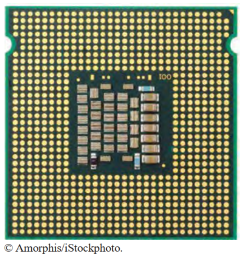
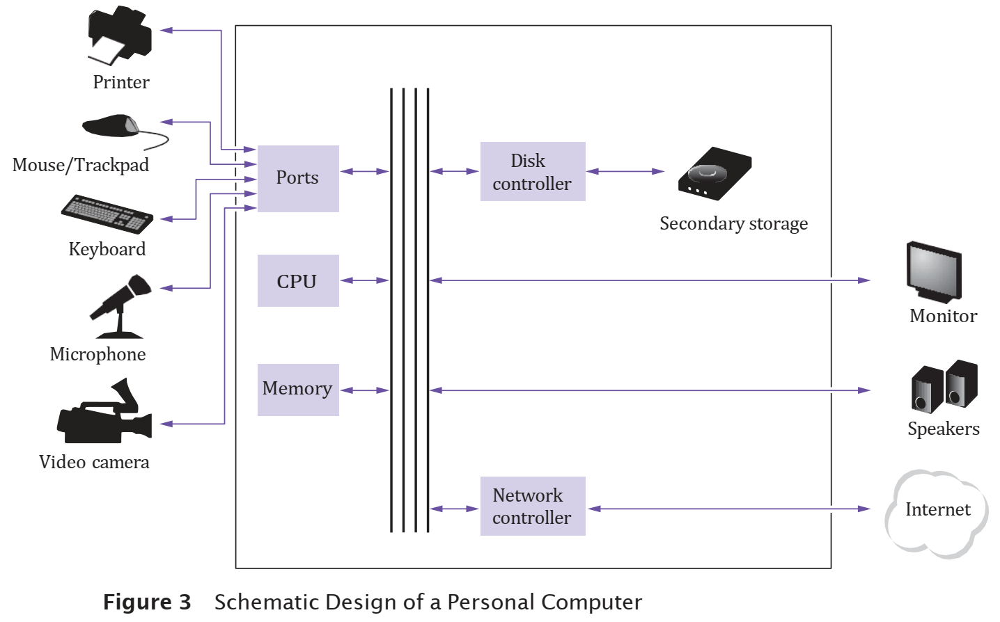
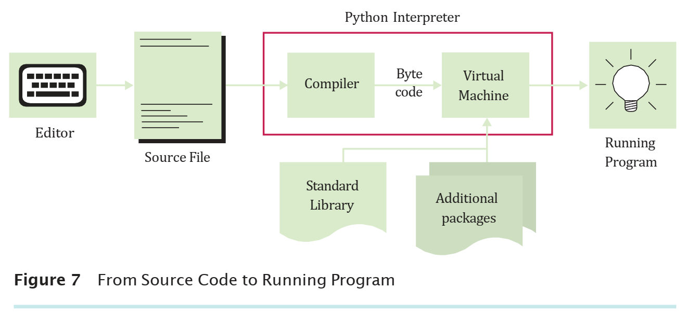
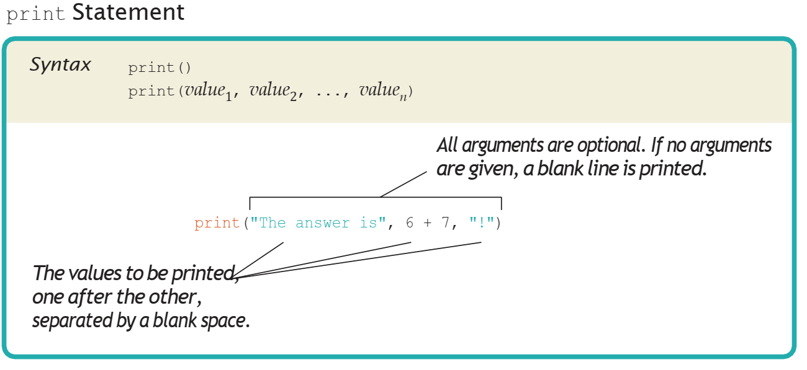

# Lesson 1. Introduction to Programming and Python

**Last updated:** September 4, 2026

> **Source:** Chapter 1 – *Introduction*, in *Python for Everyone, 3rd Edition* by Cay Horstmann and Rance Necaise.
>
> This lecture preserves the structure and focus of Chapter 1, but is presented in a form suitable for direct classroom use.

---

## Lesson Introduction

Before learning about variables, expressions, conditional statements, or loops, students need to understand three fundamental issues:

1. **What is a computer, and how does it execute a program?**
2. **How is Python used to write and run programs?**
3. **How can we describe a solution before we start writing code?**

This chapter begins with the concept of a **computer program**, introduces the main components of a computer, and then shows how to write and run a first Python program. The final part focuses on two important skills for beginning programmers:

- identifying and fixing errors;
- designing algorithms with **pseudocode** before translating them into Python code.

---

## Knowledge and Skills to Be Achieved

After completing this lesson, students will be able to:

- Explain the concepts of a **computer program** and **programming**.
- Distinguish between **hardware** and **software**.
- Describe the roles of the **CPU**, **memory**, **secondary storage**, and input/output devices.
- Explain why a **high-level programming language** is needed.
- State several basic advantages of Python.
- Create, save, and run a simple Python program.
- Use **interactive mode** to quickly test Python statements.
- Explain, at a conceptual level, the process:

  **source code → byte code → virtual machine → running program**.

- Analyze the structure of the `Hello, World!` program.
- Distinguish among **compile-time errors**, **exceptions**, and **run-time/logic errors**.
- Explain the concepts of an **algorithm** and **pseudocode**.
- Describe an algorithm using steps that are clear, executable, and terminating.

---

## Lesson Structure

1. Computer Programs
2. The Anatomy of a Computer
3. Computers Are Everywhere
4. The Python Programming Language
5. Becoming Familiar with Your Programming Environment
6. Interactive Mode and Backup Copies
7. The Python Interpreter
8. Analyzing Your First Program
9. Errors
10. Problem Solving: Algorithm Design
11. Data Is Everywhere
12. How To: Describing an Algorithm with Pseudocode
13. Worked Example: Tiling a Floor
14. Summary and Exercises

---

# 1.1 Computer Programs

## 1.1.1 Computers Can Perform Many Different Tasks

Computers can be used for many different purposes:

- word processing;
- calculations;
- electronic banking;
- playing games;
- image processing;
- controlling devices;
- data analysis.

An important point is that **the same physical computer** can perform many different tasks.

The reason is that a computer is not limited to a single job. It can execute different **programs**.

### What Is a Computer Program?

A **computer program** is a sequence of instructions and decisions that tells a computer to perform a specific task.

We can visualize it as follows:

```text
Problem
   ↓
Program
   ↓
Very basic instructions
   ↓
The computer executes them at high speed
   ↓
Result
```

A very low-level computer instruction can be as simple as:

- drawing a dot at a position on the screen;
- adding two numbers;
- checking a value;
- jumping to another instruction if a condition is true.

A modern application may contain millions of such small instructions.

---

## 1.1.2 Hardware and Software

### Hardware

**Hardware** consists of all the physical components of a computer and its peripheral devices.

Examples:

- CPU;
- memory;
- disk drive;
- monitor;
- keyboard;
- mouse;
- printer.

### Software

**Software** consists of the programs that a computer executes.

Examples:

- operating systems;
- web browsers;
- office software;
- Python;
- programs that we write ourselves.

### What Is Programming?

**Programming** is the process of:

> designing and implementing computer programs.

Programming is not only typing code. It also includes:

- understanding the problem;
- designing a solution;
- writing the program;
- testing;
- debugging;
- improving the program.

---

## Self Check 1.1

### Question 1

What is a computer program?

A. A physical device inside a computer  
B. A sequence of instructions and decisions that tells a computer to perform a task  
C. A type of data  
D. An input device

<details>
<summary>Answer</summary>

**B.** A computer program is a sequence of instructions and decisions that are executed to complete a task.

</details>

### Question 2

Distinguish between hardware and software.

<details>
<summary>Answer</summary>

- **Hardware:** physical components.
- **Software:** programs that control and use the hardware.

</details>

### Question 3

True or false: Programming simply means typing Python statements into a computer.

<details>
<summary>Answer</summary>

**False.** Programming also includes problem analysis, algorithm design, testing, and debugging.

</details>

---

# 1.2 The Anatomy of a Computer

To understand programming, we need to know where programs are executed and how data is stored.

## 1.2.1 Central Processing Unit – CPU

The **CPU (Central Processing Unit)** is the central component responsible for:

- locating and executing program instructions;
- performing arithmetic operations;
- processing data;
- reading data from memory or devices;
- writing results back to memory or storage devices.

The CPU can be viewed as the component that directly carries out the steps requested by a program.

<p align="center">
  
</p>

---

## 1.2.2 Primary Storage – Main Memory

**Primary storage**, or memory, is used to store:

- programs that are currently running;
- data currently being processed by those programs.

Characteristics:

- fast;
- directly accessible by the CPU;
- usually requires electrical power to retain data.

In a personal computer, primary storage is usually **RAM**.

<p align="center">
  
</p>

---

## 1.2.3 Secondary Storage

**Secondary storage** is used for long-term data storage.

Examples:

- HDD;
- SSD;
- USB drives;
- other storage devices.

Compared with memory:

| Characteristic | Primary storage | Secondary storage |
|---|---|---|
| Speed | Faster | Slower |
| Cost / capacity | Higher | Lower |
| Retains data without power | Usually no | Yes |
| Role | Data currently being processed | Long-term storage |

---

## 1.2.4 Input and Output

### Input

Data can be entered into a computer through:

- keyboard;
- mouse/trackpad;
- microphone;
- camera;
- network.

### Output

A computer can send results through:

- monitor;
- speakers;
- printer;
- network.

---

## 1.2.5 Relationship Among the Components

A simple model is shown below:

<p align="center">
  
</p>

### When a Program Runs

1. The program is stored in secondary storage.
2. When it is run, the program is loaded into memory.
3. The CPU reads the instructions one by one.
4. The CPU processes the data.
5. The results may be:
   - stored in memory;
   - written to secondary storage;
   - sent to an output device.

---

## Self Check 1.2

### Question 1

What is the main role of the CPU?

<details>
<summary>Answer</summary>

The CPU controls program execution and processes data: it locates, reads, and executes instructions; performs calculations; and exchanges data with memory and devices.

</details>

### Question 2

Distinguish between primary storage and secondary storage.

<details>
<summary>Answer</summary>

Primary storage is faster and is used for programs and data currently being processed. Secondary storage is slower but is used for long-term storage.

</details>

### Question 3

When a program begins to run, where is it usually loaded from and where is it loaded to?

<details>
<summary>Answer</summary>

From **secondary storage** into **memory**.

</details>

---

# Computing & Society 1.1 – Computers Are Everywhere

Early computers were very large. Systems such as ENIAC occupied an entire room.

Today, computers appear at many different scales:

- data centers;
- laptops;
- smartphones;
- transit cards;
- automobiles;
- industrial machinery;
- medical devices;
- household appliances.

A modern car may contain many small computers that control:

- the engine;
- braking systems;
- lights;
- entertainment;
- sensors.

<p align="center">
  
</p>

### Significance

Knowledge of computers and programming is no longer only for IT specialists.

It is becoming increasingly important in:

- engineering;
- economics;
- management;
- science;
- healthcare;
- data analysis.

---

# 1.3 The Python Programming Language

## 1.3.1 Why Do We Need High-Level Programming Languages?

The CPU executes only very basic instructions.

Requiring programmers to write thousands or millions of low-level instructions directly would be:

- difficult;
- time-consuming;
- error-prone.

Therefore, **high-level programming languages** were developed.

Programmers write instructions at a higher level of abstraction. The system then automatically translates them into a form that the computer can execute.

---

## 1.3.2 Python

Python is a high-level programming language.

Python was developed by **Guido van Rossum** beginning in the early 1990s.

<p align="center">
  
</p>

Some important design goals of Python are:

- making programs easy to write;
- making programs easy to modify;
- using simple syntax;
- making it convenient to work with complex data.

---

## 1.3.3 Why Is Python Popular?

### 1. Simple Syntax

Compared with many other languages, Python has relatively concise and readable syntax.

### 2. Suitable for Beginners

Students can focus more on problem-solving thinking.

### 3. Interactive Programming

Python supports an interactive environment that lets students try individual statements and see the results immediately.

### 4. Portable

A Python program can usually run on multiple operating systems, such as:

- Windows;
- Linux;
- macOS.

### 5. Many Packages

A **package** is a collection of code that supports a particular group of problems.

Examples include packages for:

- machine learning;
- statistics;
- data visualization;
- computational biology;
- data processing.

---

## Self Check 1.3

### Question 1

Why do we use high-level programming languages?

<details>
<summary>Answer</summary>

Because writing low-level CPU instructions directly is very complex and error-prone. High-level languages make it easier to describe solutions.

</details>

### Question 2

State three advantages of Python.

<details>
<summary>Answer</summary>

Examples:

- simple syntax;
- easy to learn;
- supports interactive programming;
- portable;
- many packages.

</details>

### Question 3

What is a package?

<details>
<summary>Answer</summary>

A package is a collection of code developed to support a particular domain or class of problems, allowing programmers to reuse existing solutions.

</details>

---

# 1.4 Becoming Familiar with Your Programming Environment

To program, you need a **programming environment**.

Depending on your learning environment, you may use:

- an IDE;
- a text editor + terminal;
- the Python shell;
- a notebook environment.

## Step 1. Install the Python Environment

You need to install:

- Python;
- an appropriate editor or IDE.

## Step 2. Start the Environment

Examples:

- VS Code;
- PyCharm;
- IDLE;
- terminal;
- an environment provided by your instructor.

## Step 3. Write Your First Program

Create the file:

```text
hello.py
```

Content:

```python
# My first Python program.
print("Hello, World!")
```

## Step 4. Run the Program

Result:

```text
Hello, World!
```

## Step 5. Organize Your Files

Exercises should be organized into folders.

Example:

```text
PythonCourse/
│
├── Chapter01/
│   ├── hello.py
│   └── exercises/
│
├── Chapter02/
│
└── Chapter03/
```

### Note: Python Is Case Sensitive

Python distinguishes between uppercase and lowercase letters.

```python
print("Hello")
```

is different from:

```python
Print("Hello")
```

`Print` is not the same as `print`.

---

## Self Check 1.4

### Question 1

What is the usual extension of a Python program file?

<details>
<summary>Answer</summary>

`.py`

</details>

### Question 2

True or false: `print` and `Print` are the same name in Python.

<details>
<summary>Answer</summary>

**False.** Python distinguishes between uppercase and lowercase letters.

</details>

### Question 3

Why should Python exercises be organized into separate folders?

<details>
<summary>Answer</summary>

To make them easier to manage, find, back up, and submit.

</details>

---

# Programming Tip 1.1 – Interactive Mode

Python can commonly be used in two ways:

## Script Mode

Write a program in a file:

```text
hello.py
```

and then run the entire file.

## Interactive Mode

Enter one statement at a time and receive the result immediately.

Example:

```python
>>> print("Hello, World!")
Hello, World!
```

or:

```python
>>> 7035 * 0.15
1055.25
```

### When Should Interactive Mode Be Used?

- to try an expression;
- to check syntax;
- to learn a new function;
- to quickly test an idea;
- to use Python as a calculator.

---

## Self Check – Interactive Mode

Interactive mode is most appropriate for which situation?

A. Writing a large software system  
B. Quickly testing a Python expression  
C. Storing data permanently  
D. Replacing the CPU

<details>
<summary>Answer</summary>

**B.**

</details>

---

# Programming Tip 1.2 – Backup Copies

Files can be lost because of:

- accidental deletion;
- device failure;
- overwriting files;
- system errors.

Therefore, you should create **backup copies**.

## Basic Principles

### 1. Back Up Frequently

Do not wait until the end of the day to make a backup.

### 2. Keep Multiple Backups

You can keep multiple different versions.

### 3. Check the Copy Direction

Make sure that you are copying:

```text
work folder → backup folder
```

rather than in the opposite direction.

### 4. Check Your Backups Occasionally

A backup is useful only if it can actually be restored.

---

# Special Topic 1.1 – The Python Interpreter

We often say:

> The Python interpreter reads the program and executes it step by step.

However, internally, the process can be understood in more detail.

```text
Source code (.py)
      ↓
   Compiler
      ↓
   Byte code
      ↓
Virtual Machine
      ↓
Running Program
```

<p align="center">
   Byte code -> Virtual Machine" width="700" />
</p>

## Source Code

This is the Python code written by the programmer.

Example:

```python
print("Hello")
```

## Compiler

The compiler translates source code into **byte code**.

## Byte Code

Byte code is a simpler form of instructions used by the Python Virtual Machine.

## Virtual Machine

The virtual machine executes the byte code.

## Standard Library

Built-in functionality such as `print()` is provided by the Python Standard Library.

## Additional Packages

Specialized tasks may require installing additional packages.

---

## Self Check – Python Interpreter

### Question 1

Put the following in the correct order:

- byte code
- source code
- virtual machine
- compiler

<details>
<summary>Answer</summary>

```text
source code
→ compiler
→ byte code
→ virtual machine
```

</details>

### Question 2

Do we need to implement `print()` ourselves from scratch?

<details>
<summary>Answer</summary>

No. `print()` is functionality already provided by the Python environment.

</details>

---

# 1.5 Analyzing Your First Program

Consider the program:

```python
# My first Python program.
print("Hello, World!")
```

## 1.5.1 Comment

The line:

```python
# My first Python program.
```

is a **comment**.

A comment:

- begins with `#`;
- is intended for people reading the code;
- is not executed as a statement.

---

## 1.5.2 Statement

The line:

```python
print("Hello, World!")
```

is a Python statement.

It tells Python to perform an action.

---

## 1.5.3 Function

`print` is a **function**.

A function is:

> a collection of instructions that performs a particular task.

---

## 1.5.4 Function Call

When we write:

```python
print("Hello, World!")
```

we **call** the `print` function.

Structure:

```text
function_name(arguments)
```

---

## 1.5.5 Argument

In:

```python
print("Hello, World!")
```

the value:

```python
"Hello, World!"
```

is an **argument**.

An argument supplies data to a function.

---

## 1.5.6 String

A sequence of characters enclosed in quotation marks is called a **string**.

```python
"Hello, World!"
```

or:

```python
'Hello, World!'
```

are both strings.

---

## 1.5.7 `print()` with Multiple Arguments

Example:

```python
print("The answer is", 6 * 7)
```

Output:

```text
The answer is 42
```

The values are printed in order and, by default, are separated by spaces.

---

## 1.5.8 `print()` with No Arguments

```python
print("Hello")
print()
print("World")
```

Output:

```text
Hello

World
```

`print()` produces a blank line.

---

## Syntax – print Statement

```python
print()
print(value1, value2, ..., valuen)
```

Example:

```python
print("The answer is", 6 + 7, "!")
```

<p align="center">
  
</p>

---

## Self Check 1.5

### Question 1

In the statement:

```python
print("Python")
```

identify:

- the function name;
- the argument;
- the data type of the argument.

<details>
<summary>Answer</summary>

- Function name: `print`
- Argument: `"Python"`
- Data type: string

</details>

### Question 2

Is the following line executed by Python?

```python
# Calculate the total cost.
```

<details>
<summary>Answer</summary>

No. It is a comment.

</details>

### Question 3

What is the output of:

```python
print("The answer is", 6 + 7, "!")
```

<details>
<summary>Answer</summary>

```text
The answer is 13 !
```

</details>

---

# 1.6 Errors

Errors are a normal part of program development.

Programmers need to learn how to:

- read error messages;
- identify the type of error;
- locate the error;
- fix the error;
- test again.

---

## 1.6.1 Compile-Time Error / Syntax Error

Example:

```python
print("Hello, World!)
```

When the statement above is run, the closing double quotation mark `"` is missing. Python stops during syntax analysis and displays an error message:

```text
SyntaxError: EOL while scanning string literal
```

*(Note: In newer Python versions from 3.10 onward, this error may be displayed more clearly as `SyntaxError: unterminated string literal (detected at line 1)`).*

**Explanation of the error message:**

- **`SyntaxError`:** A syntax error (the source code violates the grammatical rules of the Python language).
- **`EOL` (End Of Line):** The end of the line.
- **`string literal`:** A string literal (text enclosed in a matching pair of double quotation marks `"` or single quotation marks `'`).
- **Nature of the error:** The Python interpreter is scanning a string literal (which begins with `"`) but reaches the end-of-line character before finding a corresponding closing double quotation mark.

This error violates Python syntax and is detected during the stage in which source code is compiled into byte code (before the program executes normally). Therefore, this is a **compile-time error** or **syntax error**.

### Another Example

```python
print(Hello, World!)
```

Python does not understand `Hello` and `World` in the way the programmer intended. Because the quotation marks are missing, Python treats `Hello` and `World` as variables/identifiers, and the comma-separated structure makes the statement syntactically invalid (reported as `SyntaxError: invalid syntax`).

---

## 1.6.2 Exception

Example:

```python
print(1 / 0)
```

The syntax is valid, but division by zero cannot be performed.

Python raises:

```text
ZeroDivisionError
```

This is an **exception** that occurs while the program is running.

---

## 1.6.3 Logic / Run-Time Error

Example:

```python
print("Hello, Word!")
```

The program:

- is syntactically valid;
- runs;
- does not raise an exception;

but the output is not what was intended.

This is a logic error.

---

## Comparing the Types of Errors

| Error type | When it is detected | Example |
|---|---|---|
| Syntax / compile-time | Before correct execution | missing quotation mark |
| Exception | While running | division by zero |
| Logic error | Program runs but produces an incorrect result | prints `"Word"` instead of `"World"` |

---

# Common Error 1.1 – Misspelling Words

Python distinguishes between uppercase and lowercase letters.

Incorrect:

```python
Print("Hello")
```

Correct:

```python
print("Hello")
```

A small spelling mistake can produce an error message that may initially seem confusing.

When you receive an error related to:

- an undefined name;
- a function that does not exist;

check:

- spelling;
- capitalization;
- punctuation.

---

## Self Check 1.6

### Question 1

What type of error occurs in:

```python
print("Hello)
```

<details>
<summary>Answer</summary>

A syntax / compile-time error.

</details>

### Question 2

What type of error occurs in:

```python
print(10 / 0)
```

<details>
<summary>Answer</summary>

An exception during execution, specifically `ZeroDivisionError`.

</details>

### Question 3

What type of error occurs when a program runs but produces an incorrect result?

<details>
<summary>Answer</summary>

A logic error / run-time error according to the classification used in this chapter.

</details>

---

# 1.7 Problem Solving: Algorithm Design

Before writing code, we need to determine:

> What steps must the computer perform?

A computer cannot automatically understand a vague request.

For example:

> “Find the person who is the best match for me.”

This request is not precise enough because “best match” may depend on personal judgment.

In contrast, the problem:

> There is $10,000 in an account earning 5% interest per year. After how many years will the balance reach at least $20,000?

can be described with clear steps.

---

## 1.7.1 Pseudocode

**Pseudocode** is an informal description of the steps for solving a problem.

Example:

```text
Set year to 0.

Set balance to 10000.

While balance is less than 20000:

    Add 1 to year.

    Set interest to balance × 0.05.

    Add interest to balance.

Report year.
```

Pseudocode:

- does not have to follow Python syntax;
- is intended for humans;
- focuses on the logic of the solution.

---

## 1.7.2 Algorithm

An **algorithm** is a sequence of steps for solving a problem.

According to the chapter, a good algorithm must have three characteristics:

### 1. Unambiguous

Each step must be clear and not open to interpretation.

### 2. Executable

Each step must be possible to carry out in practice.

### 3. Terminating

The algorithm must end after a finite number of steps.

---

## 1.7.3 Software Development Process

The development process can be summarized as:

```text
Understand the problem
        ↓
Develop and describe an algorithm
        ↓
Test the algorithm with simple inputs
        ↓
Translate the algorithm into Python
        ↓
Compile / run / test the program
```

The key point is:

> Do not begin by immediately typing Python code.

---

## Self Check 1.7

### Question 1

What is pseudocode?

<details>
<summary>Answer</summary>

Pseudocode is an informal but clear description of a sequence of steps used to solve a problem.

</details>

### Question 2

What are the three important characteristics of an algorithm?

<details>
<summary>Answer</summary>

- unambiguous;
- executable;
- terminating.

</details>

### Question 3

Which order is more appropriate?

A. Code → understand the problem → algorithm  
B. Understand the problem → algorithm → code  
C. Code → test → understand the problem

<details>
<summary>Answer</summary>

**B.**

</details>

---

# Computing & Society 1.2 – Data Is Everywhere

Today, data is collected on a very large scale.

Examples:

- transactions;
- images;
- video;
- sensors;
- user behavior;
- medical data;
- traffic data.

The increase in computing power has created opportunities for **data science**.

## Data Mining

Goals include:

- finding patterns;
- identifying groups of similar data;
- detecting abnormal behavior;
- supporting prediction.

## Machine Learning

Machine learning builds systems that can learn from data.

Example:

```text
Training data
     ↓
Machine-learning model
     ↓
Trained model
     ↓
New data
     ↓
Prediction
```

A model can learn from many images of dogs and cats and then predict which class a new image belongs to.

Python is very suitable for data science because it is:

- interactive;
- easy to experiment with;
- supported by many packages;
- suitable for data processing and machine learning.

---

# HOW TO 1.1 – Describing an Algorithm with Pseudocode

## Problem

You need to choose between two cars:

- car 1 is more fuel-efficient but has a higher purchase price;
- car 2 is cheaper but uses more fuel.

You know:

- purchase price;
- fuel efficiency;
- gas price;
- the number of kilometers/miles driven each year;
- the length of time the car will be used.

Determine which car has the lower total cost.

---

## Step 1. Determine the Inputs and Output

### Input

For each car:

- purchase price;
- fuel efficiency.

General information:

- annual miles driven;
- gas price;
- number of years.

### Output

The car with the lower total cost.

---

## Step 2. Break the Problem into Smaller Tasks

For each car:

```text
annual fuel consumed

annual fuel cost

operating cost

total cost
```

---

## Step 3. Write the Pseudocode

```text
For each car:

    annual fuel consumed =
        annual miles driven / fuel efficiency

    annual fuel cost =
        price per gallon × annual fuel consumed

    operating cost =
        10 × annual fuel cost

    total cost =
        purchase price + operating cost

If total cost of car 1 < total cost of car 2:

    Choose car 1.

Else:

    Choose car 2.
```

---

## Step 4. Test the Pseudocode with a Specific Example

Suppose:

### Car 1

- price = 25,000
- fuel efficiency = 50 mpg

### Car 2

- price = 20,000
- fuel efficiency = 30 mpg

For Car 1:

```text
annual fuel consumed = 15000 / 50 = 300

annual fuel cost = 4 × 300 = 1200

operating cost = 10 × 1200 = 12000

total cost = 25000 + 12000 = 37000
```

If Car 2 has a total cost of 40,000, choose Car 1.

---

## Self Check – Pseudocode Design

Why should you test pseudocode with a simple example before writing Python code?

<details>
<summary>Answer</summary>

Because checking the solution by hand helps detect logical errors in the algorithm before adding the complexity of programming syntax.

</details>

---

# WORKED EXAMPLE 1.1 – Writing an Algorithm for Tiling a Floor

## Problem

Tile a rectangular floor using alternating black and white tiles.

Each tile is:

```text
4 × 4 inches
```

The floor dimensions are multiples of 4.

---

## Step 1. Input and Output

### Input

- length;
- width.

### Output

An arrangement of black and white tiles that completely covers the floor.

---

## Step 2. Break Down the Problem

A natural subproblem is:

> Tile one row.

If we can tile one row, we can repeat the process row by row until the entire floor is covered.

Within a row:

- begin with one color;
- use the opposite color for the next tile;
- continue until the row is complete.

---

## Step 3. Pseudocode

```text
Place a black tile in the northwest corner.

While the floor is not yet filled:

    Repeat until the current row is filled:

        If the previously placed tile was white:

            Pick a black tile.

        Else:

            Pick a white tile.

        Place the picked tile east of the previous tile.

    Locate the first tile of the completed row.

    If there is space to the south:

        Place a tile of the opposite color below it.
```

---

## Step 4. Test with an Example

Suppose the floor is:

```text
20 × 12 inches
```

Each tile is:

```text
4 × 4 inches
```

Number of columns:

```text
20 / 4 = 5
```

Number of rows:

```text
12 / 4 = 3
```

One possible arrangement is:

```text
B W B W B

W B W B W

B W B W B
```

where:

- `B` = Black
- `W` = White

---

# Chapter 1 Summary

## Computer Programs

- Computers execute basic instructions at very high speed.
- A computer program is a sequence of instructions and decisions.
- Programming is the process of designing and implementing programs.

## Computer Architecture

- The CPU performs control and processing.
- Memory stores programs/data that are currently active.
- Secondary storage stores data for the long term.
- Peripheral devices provide input/output.

## Python

- Python is a high-level programming language.
- Python is easy to learn, portable, and supported by many packages.
- Python supports interactive programming.

## Programming Environment

- Programs are usually stored in `.py` files.
- Python distinguishes between uppercase and lowercase letters.
- Files should be organized and backed up regularly.

## First Program

```python
print("Hello, World!")
```

This introduces:

- comments;
- statements;
- functions;
- function calls;
- arguments;
- strings.

## Errors

- syntax / compile-time errors;
- exceptions;
- logic / run-time errors.

## Algorithm Design

An algorithm must be:

- unambiguous;
- executable;
- terminating.

Recommended process:

```text
Problem

↓

Algorithm

↓

Test by hand

↓

Python code

↓

Run and test
```

---

# Summary Quiz

## Question 1

Programming is:

A. Only using software  
B. Designing and implementing computer programs  
C. Only writing comments  
D. Only fixing errors

<details>
<summary>Answer</summary>

**B**

</details>

## Question 2

Which component directly executes program instructions?

A. CPU  
B. Printer  
C. Keyboard  
D. Hard disk

<details>
<summary>Answer</summary>

**A**

</details>

## Question 3

A Python program file usually has which extension?

A. `.java`  
B. `.cpp`  
C. `.py`  
D. `.txt`

<details>
<summary>Answer</summary>

**C**

</details>

## Question 4

Which line is a comment?

A. `print("Hello")`  
B. `# print a greeting`  
C. `"Hello"`  
D. `print()`

<details>
<summary>Answer</summary>

**B**

</details>

## Question 5

In:

```python
print("Hello")
```

`"Hello"` is:

A. a function  
B. a comment  
C. an argument and a string  
D. a syntax error

<details>
<summary>Answer</summary>

**C**

</details>

## Question 6

The code:

```python
print(1 / 0)
```

causes:

A. a syntax error  
B. an exception  
C. no error  
D. a comment

<details>
<summary>Answer</summary>

**B**

</details>

## Question 7

Pseudocode is mainly used to:

A. replace the CPU  
B. describe algorithm logic before coding  
C. create backup files  
D. install Python

<details>
<summary>Answer</summary>

**B**

</details>

## Question 8

A valid algorithm must be:

A. unambiguous  
B. executable  
C. terminating  
D. all three

<details>
<summary>Answer</summary>

**D**

</details>

---

# Practice Exercises

## Exercise 1. Hello Python

Write a program that prints:

```text
Hello, Python!

I am learning programming.
```

---

## Exercise 2. Analyze the Program

Given:

```python
# Calculate an answer.

print("The answer is", 8 + 5)
```

Identify:

- the comment;
- the function;
- the function call;
- the arguments;
- the string;
- the expression.

---

## Exercise 3. Classify the Errors

For each code segment below, identify the type of error.

### a.

```python
print("Hello)
```

### b.

```python
print(10 / 0)
```

### c.

```python
print("Goodbye")
```

when the requirement is to print `"Hello"`.

<details>
<summary>Hint / Answer</summary>

- a: syntax error.
- b: exception.
- c: logic error.

</details>

---

## Exercise 4. Interactive Mode

In Python interactive mode, try:

```python
10 + 20

8 * 7

100 / 4

2 ** 10
```

Record the results.

---

## Exercise 5. Algorithm Design

An account has:

```text
balance = 10,000
```

Each month:

- it earns 0.5% interest;
- 500 is withdrawn.

Write pseudocode to determine after how many months the account will run out of money.

---

## Exercise 6. Commuting Cost

You can:

- drive a car;
- take a train.

You know:

- the distance;
- fuel consumption;
- gas price;
- train ticket price.

Describe an algorithm to determine which option is cheaper.

---

# Open Exercises

## Exercise 1

Is a smartphone a single-function device or a programmable computer? Explain.

## Exercise 2

Give three examples of computers embedded in devices that do not look like traditional computers.

## Exercise 3

Explain why the problem:

> “Find the person who is the best match for me.”

is difficult to translate directly into an algorithm.

## Exercise 4

Choose an everyday task and describe it using pseudocode.

Examples:

- making coffee;
- logging into a system;
- calculating a purchase total;
- sending an email.

The pseudocode must be:

- clear;
- executable;
- terminating.

---

# Key Terms

| Term | Meaning |
|---|---|
| Computer program | A sequence of instructions and decisions for a computer |
| Programming | Designing and implementing programs |
| Hardware | Physical components of a computer |
| Software | Computer programs |
| CPU | Central Processing Unit |
| Memory | Primary storage |
| Secondary storage | Long-term storage |
| Input | Data entered into the system |
| Output | Information produced by the system |
| High-level language | High-level programming language |
| Python | A high-level programming language |
| Package | A collection of code supporting a domain/problem |
| Interpreter | Component that executes Python programs |
| Source code | Code written by a programmer |
| Byte code | Intermediate code for the virtual machine |
| Comment | A note for people reading the code |
| Function | A collection of instructions that performs a task |
| Argument | A value passed to a function |
| String | A sequence of characters |
| Syntax error | An error in syntax |
| Exception | An error that occurs while executing an operation |
| Logic error | The program runs but produces an incorrect result |
| Pseudocode | An informal description of an algorithm |
| Algorithm | A clear sequence of steps for solving a problem |

---

# Study Guidance

After finishing Chapter 1, students do not need to try to write complex programs yet. The most important goal is to develop the following workflow:

```text
Understand the problem

→ work out the solution by hand

→ describe it as an algorithm/pseudocode

→ translate it into Python

→ run it

→ read the errors

→ fix them

→ test again
```

This workflow will be used throughout the following chapters.
