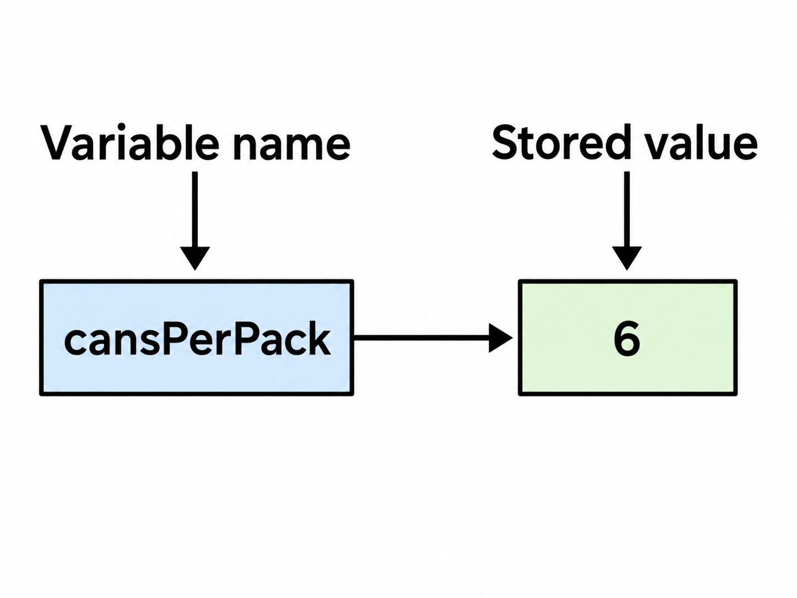

# Lesson 2. Programming with Numbers and Strings

**Last updated:** September 11, 2026

> **Source:** Chapter 2 – *Programming with Numbers and Strings*, in *Python for Everyone, 3rd Edition* by Cay Horstmann and Rance Necaise.
>
> This lecture preserves the structure, terminology, examples, and instructional focus of Chapter 2, while reorganizing the material for direct classroom use. The examples intentionally follow the conventions used in the textbook, including its variable-naming style and the `%` string-format operator.

---

## Lesson Introduction

Chapter 1 introduced the idea of a computer program, the basic organization of a computer, the Python programming environment, and the role of algorithms. Chapter 2 begins the transition from *understanding what programs are* to *writing programs that perform useful computations*.

The main building blocks introduced in this chapter are:

1. **Variables** for storing values.
2. **Numeric types** for representing integers and floating-point values.
3. **Arithmetic expressions** for computing new values.
4. **Strings** for representing and manipulating text.
5. **Input and output** for communicating with the program user.
6. **Simple graphics** for producing drawings with geometric shapes and text.

A recurring theme throughout the chapter is that a program should not be written by immediately typing Python statements. A better workflow is:

```text
Understand the problem
        ↓
Work out a concrete example by hand
        ↓
Identify variables and constants
        ↓
Develop the computation / pseudocode
        ↓
Translate the solution into Python
        ↓
Run, inspect, and improve the result
```

---

## Knowledge and Skills to Be Achieved

After completing this lesson, students will be able to:

- Define and use **variables** and **constants**.
- Explain the difference between `int` and `float` values.
- Apply the assignment operator `=` correctly.
- Choose valid and descriptive variable names.
- Use comments to explain program intent.
- Write arithmetic expressions using `+`, `-`, `*`, `/`, `//`, `%`, and `**`.
- Explain operator precedence and the role of parentheses.
- Call built-in functions such as `abs()`, `round()`, `min()`, and `max()`.
- Import and use functions from the `math` module.
- Recognize floating-point **roundoff errors**.
- Perform a computation by hand before programming it.
- Create and manipulate **strings**.
- Use string concatenation, repetition, indexing, and methods.
- Convert between strings and numbers using `str()`, `int()`, and `float()`.
- Use `input()` to obtain user input.
- Format numeric and string output using the textbook's `%` formatting operator.
- Write small programs according to an **Input → Process → Output** structure.
- Create simple graphical drawings using a graphics window and canvas.
- Decompose a drawing into lines, rectangles, ovals, and text.

---

## Lesson Structure

1. Variables
2. Arithmetic
3. Problem Solving: First Do It By Hand
4. Strings
5. Input and Output
6. Graphics: Simple Drawings
7. Optional Toolbox: Symbolic Processing with SymPy
8. Summary and Exercises

---

# 2.1 Variables

A program becomes useful when it can store values, modify them, and use them in later computations.

A **variable** is a storage location in a computer program. Each variable has:

- a **name**;
- a **value** currently stored in that location.

A useful analogy is a labeled parking space:


The name identifies the storage location; the value is its current content.

---

## 2.1.1 Defining Variables

A value is stored in a variable with an **assignment statement**.

```python
cansPerPack = 6
```

The general form is:

```text
variableName = value
```

The first time a variable is assigned a value, the variable is **created and initialized**.

```python
cansPerPack = 6
print(cansPerPack)
```

Output:

```text
6
```

If the variable is assigned another value later, the previous value is replaced.

```python
cansPerPack = 6
cansPerPack = 8
print(cansPerPack)
```

Output:

```text
8
```

### Assignment Is Not Mathematical Equality

The symbol `=` in Python is the **assignment operator**. It does not mean mathematical equality.

Consider:

```python
cansPerPack = cansPerPack + 2
```

If `cansPerPack` currently contains `8`, Python performs the following steps:

```text
1. Read the current value: 8
2. Compute 8 + 2 = 10
3. Store 10 back into cansPerPack
```

After the statement executes:

```python
cansPerPack == 10
```

conceptually, the variable now stores `10`.

This is perfectly meaningful in programming, even though the algebraic statement `x = x + 2` would be impossible as an equation.

---

## 2.1.2 Number Types

Every value in Python has a **data type**. The data type determines:

- how the value is represented;
- which operations can be performed on the value.

Two important numeric types are:

| Python type | Meaning | Examples |
|---|---|---|
| `int` | integer / whole number | `6`, `0`, `-25` |
| `float` | floating-point number | `0.355`, `1.0`, `-3.5` |

Examples:

```python
count = 6
price = 2.95
```

A numeric value written directly in a program is called a **number literal**.

```python
6
0.5
1.0
1E6
2.96E-2
```

Important observations:

- `6` is an `int`.
- `6.0` is a `float`.
- Numbers written in exponential notation such as `1E6` are floating-point values.

The type is associated with the **value**, not permanently with the variable name.

```python
taxRate = 5
taxRate = 5.5
```

Python allows this. However, the chapter recommends keeping the type of a variable conceptually consistent. If a variable represents a tax rate, initialize it as a floating-point value when fractional values are possible:

```python
taxRate = 5.0
```

---

## 2.1.3 Variable Names

Variable names must follow Python's naming rules.

### Rules

1. A name must start with a letter or underscore `_`.
2. Remaining characters may be letters, digits, or underscores.
3. Spaces and symbols such as `?`, `%`, `.`, and `/` are not allowed.
4. Names are **case sensitive**.
5. Reserved words such as `if` and `class` cannot be used as variable names.

Examples:

| Name | Valid? | Comment |
|---|---:|---|
| `canVolume1` | Yes | Letters and digits are allowed. |
| `x` | Yes | Legal, but often not descriptive enough. |
| `CanVolume` | Yes | Different from `canVolume`; violates the book's lowercase-variable convention. |
| `6pack` | No | Cannot start with a digit. |
| `can volume` | No | Cannot contain spaces. |
| `class` | No | Reserved word. |
| `ltr/fl.oz` | No | Contains `/` and `.`. |

### Descriptive Names

Compare:

```python
cv = 0.355
```

with:

```python
canVolume = 0.355
```

The second name gives much more information about the meaning of the variable.

---

## 2.1.4 Constants

A **constant** is a value that should remain unchanged throughout the program.

Python does not technically prevent a programmer from changing a constant. Instead, the chapter uses the convention of writing constant names in uppercase letters.

```python
BOTTLE_VOLUME = 2.0
MAX_SIZE = 100
```

Named constants make programs easier to understand.

Less clear:

```python
totalVolume = bottles * 2
```

Clearer:

```python
BOTTLE_VOLUME = 2.0
totalVolume = bottles * BOTTLE_VOLUME
```

The named constant explains *why* the value `2.0` appears in the computation.

---

## 2.1.5 Comments

A **comment** is an explanation written for human readers.

```python
CAN_VOLUME = 0.355  # Liters in a 12-ounce can
```

Python ignores everything from `#` to the end of the line.

A file-level comment can explain the purpose of a program:

```python
##
# This program computes the volume, in liters, of a six-pack of soda cans.
#
```

Comments are particularly useful for explaining:

- program purpose;
- non-obvious constants;
- important assumptions;
- major steps of a computation.

---

## Example – Computing Soda Volume

```python
##
# This program computes the volume of a six-pack of soda cans
# and the total volume when a two-liter bottle is added.
#

CAN_VOLUME = 0.355
BOTTLE_VOLUME = 2.0

cansPerPack = 6

totalVolume = cansPerPack * CAN_VOLUME
print("A six-pack of 12-ounce cans contains", totalVolume, "liters.")

totalVolume = totalVolume + BOTTLE_VOLUME
print("A six-pack and a two-liter bottle contain", totalVolume, "liters.")
```

Conceptually:

```text
6 cans × 0.355 L/can = 2.13 L
2.13 L + 2.00 L       = 4.13 L
```

---

# Common Error 2.1 – Using Undefined Variables

A variable must be created before it is used.

Incorrect:

```python
canVolume = 12 * literPerOunce
literPerOunce = 0.0296
```

When Python executes the first statement, `literPerOunce` does not yet exist.

Python therefore raises a **`NameError`**:

```text
NameError: name 'literPerOunce' is not defined
```

## Why Does This Error Occur?

Python executes statements **from top to bottom**.

At this point:

```python
canVolume = 12 * literPerOunce
```

Python tries to find the current value of `literPerOunce`, but that variable has not yet been assigned a value.

Therefore, the name is **undefined**.

Correct:

```python
literPerOunce = 0.0296
canVolume = 12 * literPerOunce
```

Program statements are executed in order, so definitions must appear before uses.

---

# Programming Tip 2.1 – Choose Descriptive Variable Names

Prefer:

```python
canVolume = 0.355
```

over:

```python
cv = 0.355
```

Descriptive names reduce the mental effort required to understand a program and make code easier to maintain.

---

# Programming Tip 2.2 – Do Not Use Magic Numbers

A **magic number** is an unexplained numeric literal in a program.

Less clear:

```python
totalVolume = bottles * 2
```

Better:

```python
BOTTLE_VOLUME = 2.0
totalVolume = bottles * BOTTLE_VOLUME
```

Using named constants makes changes safer. If the bottle size changes, only the constant definition needs to be updated.

---

## Self Check 2.1

### Question 1

What happens the first time this statement is executed?

```python
count = 10
```

<details>
<summary>Answer</summary>

A variable named `count` is created and initialized with the integer value `10`.

</details>

### Question 2

Suppose:

```python
x = 7
x = x + 3
```

What value does `x` contain afterwards?

<details>
<summary>Answer</summary>

`10`.

Python first evaluates `x + 3`, then stores the result back into `x`.

</details>

### Question 3

What is the difference between `6` and `6.0`?

<details>
<summary>Answer</summary>

`6` has type `int`; `6.0` has type `float`.

</details>

### Question 4

Which name best represents a constant?

A. `bottleVolume`  
B. `BOTTLE_VOLUME`  
C. `bottle volume`  
D. `2liters`

<details>
<summary>Answer</summary>

**B. `BOTTLE_VOLUME`**

The chapter uses uppercase names for constants.

</details>

### Question 5

Why is the following code incorrect?

```python
result = price * quantity
quantity = 4
```

<details>
<summary>Answer</summary>

`quantity` is used before it is created and initialized.

</details>

---

# 2.2 Arithmetic

Python can be used as a calculator, but arithmetic expressions must be written using Python's operators and syntax.

---

## 2.2.1 Basic Arithmetic Operations

The basic operators are:

| Operation | Python operator | Example |
|---|---:|---|
| Addition | `+` | `a + b` |
| Subtraction | `-` | `a - b` |
| Multiplication | `*` | `a * b` |
| Division | `/` | `a / b` |

For example, the mathematical expression

$$
\frac{a+b}{2}
$$

is written in Python as:

```python
(a + b) / 2
```

The combination of literals, variables, operators, and parentheses is called an **expression**.

### Operator Precedence

Python follows precedence rules similar to algebra:

1. Parentheses
2. Exponentiation
3. Multiplication and division
4. Addition and subtraction

Example:

```python
a + b / 2
```

computes `b / 2` first.

To average `a` and `b`, use:

```python
(a + b) / 2
```

Operators of the same precedence are generally evaluated from left to right.

```python
10 - 2 - 3
```

is evaluated as:

```text
(10 - 2) - 3 = 5
```

### Mixing `int` and `float`

If integer and floating-point values are mixed in an arithmetic expression, the result is a floating-point value.

```python
7 + 4.0
```

Result:

```text
11.0
```

---

## 2.2.2 Powers

Python uses `**` for exponentiation.

```python
2 ** 3
```

means:

$$
2^3 = 8
$$

Example:

```python
10 * 2 ** 3
```

Result:

```text
80
```

Exponentiation has higher precedence than multiplication.

Power operations are evaluated from right to left:

```python
10 ** 2 ** 3
```

is interpreted as:

```text
10 ** (2 ** 3)
```

not:

```text
(10 ** 2) ** 3
```

A mathematical expression such as

$$
b\left(1 + \frac{r}{100}\right)^n
$$

becomes:

```python
b * (1 + r / 100) ** n
```

---

## 2.2.3 Floor Division and Remainder

Normal division `/` produces a floating-point result.

```python
7 / 4
```

Result:

```text
1.75
```

### Floor Division `//`

For positive integers, `//` computes the quotient and discards the fractional part.

```python
7 // 4
```

Result:

```text
1
```

### Remainder `%`

The `%` operator computes the remainder.

```python
7 % 4
```

Result:

```text
3
```

### Example – Converting Pennies to Dollars and Cents

```python
pennies = 1729

dollars = pennies // 100
cents = pennies % 100

print(dollars)
print(cents)
```

Output:

```text
17
29
```

Useful patterns for a positive integer `n`:

```python
n % 10       # last digit
n // 10      # all digits except the last
n % 100      # last two digits
n % 2        # 0 if even, 1 if odd
```

---

## 2.2.4 Calling Functions

A function may **return a value** that can be used in an expression, printed, or stored in a variable.

Example:

```python
distance = abs(-173)
```

`abs()` returns the absolute value.

Other useful built-in mathematical functions include:

| Function | Purpose |
|---|---|
| `abs(x)` | Absolute value of `x` |
| `round(x)` | Round `x` to a whole number |
| `round(x, n)` | Round `x` to `n` decimal places |
| `max(x1, ..., xn)` | Largest argument |
| `min(x1, ..., xn)` | Smallest argument |

Examples:

```python
print(abs(-10))
print(round(7.627, 2))
print(min(7.25, 10.95, 5.95, 6.05))
```

A function must be called with an appropriate number of arguments.

Incorrect:

```python
abs()
abs(-10, 2)
```

The `abs()` function expects exactly one argument.

---

## 2.2.5 Mathematical Functions and the `math` Module

Python's standard library contains reusable modules.

The `math` module provides many mathematical functions.

To use `sqrt()`:

```python
from math import sqrt

y = sqrt(25)
print(y)
```

Output:

```text
5.0
```

Selected functions include:

| Function | Meaning |
|---|---|
| `sqrt(x)` | Square root |
| `trunc(x)` | Truncate floating-point value to an integer |
| `sin(x)` | Sine of `x` in radians |
| `cos(x)` | Cosine of `x` in radians |
| `tan(x)` | Tangent of `x` in radians |
| `exp(x)` | $e^x$ |
| `degrees(x)` | Radians → degrees |
| `radians(x)` | Degrees → radians |
| `log(x)` | Natural logarithm |
| `log(x, base)` | Logarithm with specified base |

The module also provides constants such as `pi`.

```python
from math import pi

area = pi * radius ** 2
```

---

# Common Error 2.2 – Roundoff Errors

Floating-point numbers cannot always represent decimal values exactly.

Example:

```python
price = 4.35
quantity = 100
total = price * quantity
print(total)
```

A computer may display a value close to, but not exactly, `435`.

This is not necessarily a programming mistake. It is a consequence of representing many decimal fractions using a finite number of binary digits.

For user-facing output, round the value or format it with a fixed number of decimal places.

---

# Common Error 2.3 – Unbalanced Parentheses

Consider:

```python
((a + b) * t / 2 * (1 - t)
```

There are more opening parentheses than closing parentheses.

A useful checking rule is:

- while scanning left to right, the number of closing parentheses should never exceed the number of opening parentheses;
- at the end, the counts must match.

---

# Programming Tip 2.3 – Use Spaces in Expressions

Prefer:

```python
x1 = (-b + sqrt(b ** 2 - 4 * a * c)) / (2 * a)
```

over:

```python
x1=(-b+sqrt(b**2-4*a*c))/(2*a)
```

Spaces make the structure of an expression easier to read.

---

# Special Topic 2.1 – Other Ways to Import Modules

Import selected functions:

```python
from math import sqrt, sin, cos
```

Import all names from a module:

```python
from math import *
```

Import the module itself:

```python
import math

y = math.sqrt(x)
```

The last style makes the origin of the function explicit.

---

# Special Topic 2.2 – Combining Assignment and Arithmetic

Python provides augmented assignment operators.

```python
total += cans
```

is equivalent to:

```python
total = total + cans
```

Similarly:

```python
total *= 2
count += 1
```

---

# Special Topic 2.3 – Line Joining

Long expressions can be split across lines when the break occurs inside parentheses.

```python
x1 = ((-b + sqrt(b ** 2 - 4 * a * c))
      / (2 * a))
```

This is preferable to breaking a complete expression at an arbitrary point.

---

## Self Check 2.2

### Question 1

What is the value of:

```python
10 + 6 / 2
```

<details>
<summary>Answer</summary>

`13.0`

Division is performed before addition.

</details>

### Question 2

What is the result of:

```python
17 // 5
17 % 5
```

<details>
<summary>Answer</summary>

```text
3
2
```

</details>

### Question 3

What is the last digit of a positive integer `n`?

<details>
<summary>Answer</summary>

```python
n % 10
```

</details>

### Question 4

Why is the following expression different from `(a + b) / 2`?

```python
a + b / 2
```

<details>
<summary>Answer</summary>

Because division has higher precedence than addition. Python computes `b / 2` first, then adds `a`.

</details>

### Question 5

Which import is required before using `sqrt(x)` in the textbook style?

<details>
<summary>Answer</summary>

```python
from math import sqrt
```

</details>

---

# 2.3 Problem Solving: First Do It By Hand

Before translating a problem into Python, work out at least one concrete example manually.

The principle is:

> If you cannot compute a solution yourself, it is unlikely that you can write a reliable program that automates the computation.

---

## Example – Alternating Tiles Along a Wall

Suppose black and white tiles are placed along a wall with the requirements:

- the first tile is black;
- colors alternate;
- the last tile must also be black.

Assume:

```text
Total width = 100 inches
Tile width  =   5 inches
```

If we use 20 tiles, the last tile would be white. Instead, think of the pattern as:

```text
B | WB | WB | WB | ... | WB
```

There is one initial black tile, followed by black/white pairs.

The first tile uses `5` inches, leaving `95` inches.

Each pair uses:

```text
2 × 5 = 10 inches
```

Number of complete pairs:

```text
95 // 10 = 9
```

Number of tiles:

```text
1 + 2 × 9 = 19
```

The tiles occupy:

```text
19 × 5 = 95 inches
```

Total unused space:

```text
100 - 95 = 5 inches
```

Gap at each end:

```text
5 / 2 = 2.5 inches
```

### General Algorithm

```text
number of pairs = integer part of
                  (total width - tile width) / (2 × tile width)

number of tiles = 1 + 2 × number of pairs

gap at each end =
    (total width - number of tiles × tile width) / 2
```

Doing the arithmetic by hand exposes the structure needed for the algorithm.

---

# Worked Example 2.1 – Computing Travel Time

A robot travels toward an item. It can move faster on a road than across rocky terrain.

Inputs:

- horizontal distance to the item;
- vertical distance to the item;
- speed on the road;
- speed on rocky terrain;
- length of the first road segment.

The total travel time consists of two parts.

### Segment 1

```text
time1 = length1 / speed1
```

### Segment 2

The second segment is the hypotenuse of a right triangle.

$$
\text{segment2Length}
=
\sqrt{(\text{xDistance}-\text{segment1Length})^2 + \text{yDistance}^2}
$$

Then:

```text
time2 = segment2Length / speed2
```

Total:

```text
totalTime = time1 + time2
```

Python version:

```python
from math import sqrt

segment1Time = segment1Length / segment1Speed
segment2Length = sqrt((xDistance - segment1Length) ** 2 + yDistance ** 2)
segment2Time = segment2Length / segment2Speed
totalTime = segment1Time + segment2Time
```

The worked example also reinforces the use of descriptive variable names in the final program.

---

## Self Check 2.3

### Question 1

Why should a programmer work out a concrete example by hand before coding?

<details>
<summary>Answer</summary>

Because a hand calculation helps reveal the required steps and exposes logical errors before Python syntax is introduced.

</details>

### Question 2

In the tile example, why is floor division useful?

<details>
<summary>Answer</summary>

Because only complete tile pairs can be placed. A fractional pair is not meaningful.

</details>

### Question 3

Which order is preferable?

A. Write code → guess the algorithm → test  
B. Work out an example → derive the algorithm → write code  
C. Write code → choose variable names → understand the problem

<details>
<summary>Answer</summary>

**B.**

</details>

---

# 2.4 Strings

Many programs process text rather than numbers.

A **string** is a sequence of characters.

Examples:

```python
"Hello"
"Python"
"123 Main Street"
```

Characters include:

- letters;
- digits;
- punctuation;
- spaces;
- Unicode symbols.

---

## 2.4.1 The String Type

A string can be stored in a variable.

```python
greeting = "Hello"
print(greeting)
```

A **string literal** is a specific string written directly in source code.

Python supports both single and double quotation marks:

```python
"This is a string."
'So is this.'
```

This allows one quotation style to appear inside the other:

```python
message = 'He said "Hello"'
```

### String Length

Use `len()` to obtain the number of characters.

```python
length = len("World!")
```

`length` becomes `6`.

Spaces count as characters.

The **empty string** contains zero characters:

```python
""
''
```

---

## 2.4.2 Concatenation and Repetition

### Concatenation `+`

The `+` operator joins strings.

```python
firstName = "Harry"
lastName = "Morgan"
name = firstName + " " + lastName
```

Result:

```text
Harry Morgan
```

Both operands must be strings.

Incorrect:

```python
"Agent " + 1729
```

### Repetition `*`

A string can be repeated by an integer factor.

```python
dashes = "-" * 50
```

Another example:

```python
message = "Echo. "
print(message * 5)
```

---

## 2.4.3 Converting Between Numbers and Strings

### Number → String

Use `str()`.

```python
id = 1729
name = "Agent " + str(id)
```

Result:

```text
Agent 1729
```

### String → Integer

Use `int()`.

```python
id = int("1729")
```

### String → Floating-Point Number

Use `float()`.

```python
price = float("17.29")
```

The string must represent a valid numeric literal for the requested conversion.

---

## 2.4.4 Strings and Characters

A string is a sequence of characters. Each character has an **index**.

Python starts counting at `0`.

```text
String:  H  a  r  r  y
Index:   0  1  2  3  4
```

Given:

```python
name = "Harry"
```

we can access individual characters:

```python
first = name[0]
last = name[4]
```

Results:

```text
first = "H"
last  = "y"
```

The last valid index is:

```python
len(name) - 1
```

A general way to get the last character is:

```python
last = name[len(name) - 1]
```

Using an index outside the valid range causes an exception at run time.

### Example – Building Initials

```python
first = "Rodolfo"
second = "Sally"
initials = first[0] + "&" + second[0]
print(initials)
```

Output:

```text
R&S
```

---

## 2.4.5 String Methods

A **method** is an operation associated with an object.

For a string object:

```python
name = "John Smith"
```

we can call:

```python
uppercaseName = name.upper()
lowercaseName = name.lower()
```

Useful methods:

| Method | Result |
|---|---|
| `s.lower()` | Lowercase version of `s` |
| `s.upper()` | Uppercase version of `s` |
| `s.replace(old, new)` | New string with replacements |

Example:

```python
name2 = name.replace("John", "Jane")
```

Result:

```text
Jane Smith
```

These methods return new strings. They do not modify the original string object.

---

# Special Topic 2.4 – Character Values

Characters are represented internally by integer codes.

Use `ord()` to obtain the code of a character:

```python
ord("H")
```

Use `chr()` to convert a numeric code back to a character:

```python
chr(97)
```

Examples:

```python
print("The letter H has code", ord("H"))
print("Code 97 represents", chr(97))
```

---

# Special Topic 2.5 – Escape Sequences

An **escape sequence** begins with a backslash and represents a special character inside a string.

Examples:

```python
"You're \"Welcome\""
```

```python
"C:\\Temp\\Secret.txt"
```

```python
print("*\n**\n***")
```

Output:

```text
*
**
***
```

Common sequences:

| Escape sequence | Meaning |
|---|---|
| `\"` | Double quotation mark inside a double-quoted string |
| `\\` | Backslash |
| `\n` | Newline |

---

# Computing & Society 2.1 – International Alphabets and Unicode

Text processing is not limited to the English alphabet.

Different writing systems include:

- accented European alphabets;
- Greek;
- Cyrillic;
- Hebrew;
- Arabic;
- Chinese characters;
- Japanese and Korean writing systems;
- symbols and emoji.

**Unicode** provides a common encoding system capable of representing characters from writing systems around the world.

Python 3 strings support Unicode.

Conceptually:

```python
text = "£100"
print(text[0])
```

Each string position corresponds to a Unicode character, not simply an ASCII byte.

---

## Self Check 2.4

### Question 1

What is the value of:

```python
len("Hello")
```

<details>
<summary>Answer</summary>

`5`

</details>

### Question 2

What is the value of:

```python
"Py" + "thon"
```

<details>
<summary>Answer</summary>

```text
Python
```

</details>

### Question 3

What does this produce?

```python
"-" * 5
```

<details>
<summary>Answer</summary>

```text
-----
```

</details>

### Question 4

Given:

```python
s = "Python"
```

what are `s[0]` and `s[len(s) - 1]`?

<details>
<summary>Answer</summary>

```text
s[0]            → "P"
s[len(s) - 1]   → "n"
```

</details>

### Question 5

Why does this fail?

```python
"Agent " + 1729
```

<details>
<summary>Answer</summary>

String concatenation requires strings on both sides. Convert the integer first:

```python
"Agent " + str(1729)
```

</details>

---

# 2.5 Input and Output

Most useful programs receive data from a user and produce results based on those inputs.

A common structure is:

```text
Input
  ↓
Process
  ↓
Output
```

---

## 2.5.1 User Input

Use `input()` to read text from the keyboard.

```python
first = input("Enter your first name: ")
```

The string passed to `input()` is the **prompt**.

Conceptually, `input()` performs these steps:

```text
Display prompt
     ↓
Wait for keyboard input
     ↓
User presses Enter
     ↓
Return entered characters as a string
```

Example:

```python
first = input("Enter your first name: ")
second = input("Enter your significant other's first name: ")

initials = first[0] + "&" + second[0]
print(initials)
```

---

## 2.5.2 Numerical Input

`input()` always returns a string.

To read an integer:

```python
userInput = input("Please enter the number of bottles: ")
bottles = int(userInput)
```

To read a floating-point value:

```python
userInput = input("Enter price per bottle: ")
price = float(userInput)
```

These operations can also be combined:

```python
bottles = int(input("Please enter the number of bottles: "))
price = float(input("Enter price per bottle: "))
```

---

## 2.5.3 Formatted Output

The chapter uses Python's `%` **string format operator** to control how values are displayed.

### Floating-Point Values

```python
price = 1.215962441314554
print("%.2f" % price)
```

Output:

```text
1.22
```

### Field Width

```python
print("%10.2f" % price)
```

The value occupies a field of width `10` and is right-justified.

### Common Format Specifiers

| Specifier | Meaning |
|---|---|
| `%d` | Integer |
| `%f` | Floating-point value |
| `%.2f` | Float with 2 digits after decimal point |
| `%7.2f` | Width 7, 2 decimal places |
| `%s` | String |
| `%9s` | Right-justified string in width 9 |
| `%-9s` | Left-justified string in width 9 |
| `%%` | Literal percent sign |
| `%+5d` | Show sign for positive/negative integer |

### Formatting Multiple Values

```python
quantity = 24
total = 17.29

print("Quantity: %d Total: %10.2f" % (quantity, total))
```

Values are matched to format specifiers from left to right.

---

## Example – Price per Ounce

```python
##
# This program prints the price per ounce for a six-pack of cans.
#

CANS_PER_PACK = 6

packPrice = float(input("Please enter the price for a six-pack: "))
canVolume = float(input("Please enter the volume for each can (in ounces): "))

packVolume = canVolume * CANS_PER_PACK
pricePerOunce = packPrice / packVolume

print("Price per ounce: %8.2f" % pricePerOunce)
```

This program demonstrates the full **Input → Process → Output** pattern.

---

# Programming Tip 2.4 – Don't Wait to Convert

When reading numeric input, convert it immediately.

Less desirable:

```python
unitPrice = input("Enter the unit price: ")
price1 = float(unitPrice)
price2 = 12 * float(unitPrice)
```

Better:

```python
unitPriceInput = input("Enter the unit price: ")
unitPrice = float(unitPriceInput)

price1 = unitPrice
price2 = 12 * unitPrice
```

Or combine the calls:

```python
unitPrice = float(input("Enter the unit price: "))
```

Immediate conversion reduces repetition and makes it less likely that a string will accidentally be used in a numerical computation.

---

# HOW TO 2.1 – Writing Simple Programs

The chapter provides a systematic method for converting a problem statement into a Python program.

## Problem – Vending Machine Change

A customer:

- selects an item;
- inserts a bill;
- receives the purchased item;
- receives change in dollar coins and quarters.

Assume item prices are multiples of 25 cents.

---

## Step 1. Understand the Inputs and Outputs

### Inputs

- bill denomination;
- item price in pennies.

### Outputs

- number of dollar coins;
- number of quarters.

---

## Step 2. Work Out an Example by Hand

Suppose:

```text
Bill inserted = $5.00
Item price    = $2.25
```

Change:

```text
$5.00 - $2.25 = $2.75 = 275 pennies
```

So the machine returns:

```text
2 dollar coins
3 quarters
```

---

## Step 3. Write Pseudocode

```text
change due = 100 × bill value - item price

dollar coins = change due // 100

change due = change due % 100

quarters = change due // 25
```

---

## Step 4. Identify Variables and Constants

Variables:

```text
billValue
itemPrice
changeDue
dollarCoins
quarters
```

Constants:

```python
PENNIES_PER_DOLLAR = 100
PENNIES_PER_QUARTER = 25
```

All values are integers because the computation uses floor division and remainders.

---

## Step 5. Translate the Computation into Python

```python
changeDue = PENNIES_PER_DOLLAR * billValue - itemPrice

dollarCoins = changeDue // PENNIES_PER_DOLLAR
changeDue = changeDue % PENNIES_PER_DOLLAR
quarters = changeDue // PENNIES_PER_QUARTER
```

---

## Step 6. Add Input and Output

```python
billValue = int(input("Enter bill value: "))
itemPrice = int(input("Enter item price in pennies: "))

print("Dollar coins: %6d" % dollarCoins)
print("Quarters:     %6d" % quarters)
```

---

## Step 7. Assemble the Program

```python
##
# This program simulates a vending machine that gives change.
#

PENNIES_PER_DOLLAR = 100
PENNIES_PER_QUARTER = 25

billValue = int(input("Enter bill value: "))
itemPrice = int(input("Enter item price in pennies: "))

changeDue = PENNIES_PER_DOLLAR * billValue - itemPrice

dollarCoins = changeDue // PENNIES_PER_DOLLAR
changeDue = changeDue % PENNIES_PER_DOLLAR
quarters = changeDue // PENNIES_PER_QUARTER

print("Dollar coins: %6d" % dollarCoins)
print("Quarters:     %6d" % quarters)
```

The method is general:

```text
Understand
→ Calculate by hand
→ Pseudocode
→ Variables/constants
→ Python computation
→ Input/output
→ Complete program
```

---

# Worked Example 2.2 – Computing the Cost of Stamps

A stamp vending machine receives dollar bills and dispenses:

- first-class stamps;
- penny stamps as change.

Assume the first-class stamp price is `49` cents, as in the textbook example.

### Input

- number of dollars inserted.

### Outputs

- number of first-class stamps;
- number of penny stamps.

### Hand Calculation for $1

```text
100 // 49 = 2 first-class stamps
100 - 2 × 49 = 2 cents change
```

### General Computation

```python
FIRST_CLASS_STAMP_PRICE = 49

firstClassStamps = 100 * dollars // FIRST_CLASS_STAMP_PRICE
change = 100 * dollars - firstClassStamps * FIRST_CLASS_STAMP_PRICE
```

Complete example:

```python
FIRST_CLASS_STAMP_PRICE = 49

dollars = int(input("Enter number of dollars: "))

firstClassStamps = 100 * dollars // FIRST_CLASS_STAMP_PRICE
change = 100 * dollars - firstClassStamps * FIRST_CLASS_STAMP_PRICE

print("First class stamps: %6d" % firstClassStamps)
print("Penny stamps:       %6d" % change)
```

This example reinforces:

- named constants;
- integer arithmetic;
- floor division;
- input conversion;
- formatted output.

---

# Computing & Society 2.2 – Bugs in Silicon

Not all incorrect numerical results are caused by application programmers.

The chapter discusses the historical **Pentium floating-point division bug**. A defect in processor hardware caused a very small set of floating-point calculations to produce incorrect results.

The broader lesson is important:

- software depends on hardware;
- hardware itself can contain defects;
- numerical computing relies on carefully designed standards and implementations;
- testing can reveal problems at multiple levels of a computing system.

The chapter also notes later processor-security issues related to speculative execution, reinforcing the idea that sophisticated optimizations can introduce unexpected risks.

---

## Self Check 2.5

### Question 1

What type does `input()` return?

<details>
<summary>Answer</summary>

A string (`str`).

</details>

### Question 2

How can an integer be read directly from user input?

<details>
<summary>Answer</summary>

```python
value = int(input("Enter a value: "))
```

</details>

### Question 3

What does `%.2f` mean in the chapter's formatting syntax?

<details>
<summary>Answer</summary>

Display a floating-point value with two digits after the decimal point.

</details>

### Question 4

Why should numerical input be converted immediately?

<details>
<summary>Answer</summary>

It avoids repeated conversions and reduces the chance of accidentally using a string in arithmetic.

</details>

### Question 5

Which operators are particularly useful when computing change in whole coin units?

<details>
<summary>Answer</summary>

Floor division `//` and remainder `%`.

</details>

---

# TOOLBOX 2.1 – Symbolic Processing with SymPy

This optional section illustrates the broader Python ecosystem.

**SymPy** is a package for symbolic mathematics. Instead of only computing numeric values, it can manipulate mathematical expressions symbolically.

Typical setup:

```python
from sympy import *
```

Create a symbolic expression:

```python
f = sympify("x ** 2 * sin(x)")
```

SymPy can perform tasks such as:

### Expanding Expressions

```python
expand((x - 1) * (x + 1))
```

### Solving Equations

```python
solve(x ** 2 + 2 * x - 8)
```

### Differentiation

```python
diff(f)
```

### Integration

```python
g = integrate(f)
```

### Substitution and Numerical Evaluation

```python
result = g.subs(x, 0).evalf()
```

### Plotting

```python
plot(x ** 2)
```

The main lesson is not to memorize all SymPy commands. It is to recognize that Python packages provide specialized expertise that can be reused inside Python programs.

---

# Chapter 2 Summary

## Variables

- A variable is a named storage location.
- Assignment stores a value in a variable.
- A variable is created when first assigned.
- Reassignment replaces the previous value.
- `=` is assignment, not mathematical equality.
- Important numeric types include `int` and `float`.
- Use descriptive names.
- Use uppercase names for constants according to the chapter convention.
- Use comments to explain intent.

## Arithmetic

Important operators:

```python
+  -  *  /  //  %  **
```

Remember:

```text
/   → normal division
//  → floor division
%   → remainder
**  → power
```

Useful functions:

```python
abs()
round()
min()
max()
```

The `math` module provides additional functions such as:

```python
sqrt()
sin()
cos()
log()
```

## Problem Solving

Before coding:

```text
Choose concrete values
→ solve by hand
→ identify the general pattern
→ write the algorithm
→ translate into Python
```

## Strings

- Strings are sequences of characters.
- `len()` returns string length.
- `+` concatenates strings.
- `*` repeats a string.
- `str()`, `int()`, and `float()` perform conversions.
- String indices begin at `0`.
- Methods such as `upper()`, `lower()`, and `replace()` return new strings.

## Input and Output

- `input()` returns a string.
- Convert numeric input using `int()` or `float()`.
- Convert as soon as practical after reading the input.
- The chapter uses the `%` string-format operator to control output layout.

## Graphics

- Create a graphics window.
- Obtain the canvas.
- Draw shapes and text on the canvas.
- The origin is at the upper-left corner.
- Color can be set by name or RGB components.

---

# Summary Quiz

## Question 1

What does an assignment statement do?

A. Tests equality  
B. Stores a value in a variable  
C. Prints a value  
D. Creates a comment

<details>
<summary>Answer</summary>

**B**

</details>

## Question 2

Which value has type `float`?

A. `6`  
B. `0`  
C. `6.0`  
D. `-4`

<details>
<summary>Answer</summary>

**C**

</details>

## Question 3

What is the result of:

```python
17 // 5
```

A. `2`  
B. `3`  
C. `3.4`  
D. `5`

<details>
<summary>Answer</summary>

**B**

</details>

## Question 4

What is the result of:

```python
17 % 5
```

A. `2`  
B. `3`  
C. `5`  
D. `17`

<details>
<summary>Answer</summary>

**A**

</details>

## Question 5

What does this expression produce?

```python
"Py" + "thon"
```

<details>
<summary>Answer</summary>

```text
Python
```

</details>

## Question 6

Given:

```python
s = "Hello"
```

what is `s[1]`?

A. `"H"`  
B. `"e"`  
C. `"l"`  
D. Error

<details>
<summary>Answer</summary>

**B. `"e"`**

</details>

## Question 7

What type does `input()` return?

A. Always `int`  
B. Always `float`  
C. `str`  
D. Depends on what the user types

<details>
<summary>Answer</summary>

**C. `str`**

</details>

## Question 8

Which statement reads a floating-point value from the user?

A. `price = input()`  
B. `price = float(input("Price: "))`  
C. `price = str(input())`  
D. `price = print(input())`

<details>
<summary>Answer</summary>

**B**

</details>

## Question 9

Which is the best reason to use a named constant?

A. It makes the program run faster in every case.  
B. It makes an unexplained numeric value easier to understand and change.  
C. It prevents Python from changing the value.  
D. It replaces comments entirely.

<details>
<summary>Answer</summary>

**B**

</details>

## Question 10

What should usually happen before translating a non-trivial computation into Python?

A. Choose random syntax.  
B. Work through at least one example by hand.  
C. Install a graphics package.  
D. Convert every value to a string.

<details>
<summary>Answer</summary>

**B**

</details>

---

# Review Exercises

## Exercise 1. Trace Assignments

Determine the final value of `mystery`:

```python
mystery = 1
mystery = 1 - 2 * mystery
mystery = mystery + 1
```

<details>
<summary>Answer</summary>

```text
Initial: mystery = 1
Second statement: mystery = 1 - 2 × 1 = -1
Third statement: mystery = -1 + 1 = 0
```

Final value: `0`.

</details>

---

## Exercise 2. Translate Mathematics into Python

Write Python expressions for:

1. The average of `a` and `b`.
2. $a^2+b^2$.
3. $\sqrt{x^2+y^2}$.
4. $PV(1+r/100)^n$.

<details>
<summary>Sample Answer</summary>

```python
(a + b) / 2

a ** 2 + b ** 2

sqrt(x ** 2 + y ** 2)

PV * (1 + r / 100) ** n
```

</details>

---

## Exercise 3. Floor Division and Remainder

Given:

```python
n = 1729
```

predict:

```python
n % 10
n // 10
n % 100
n % 2
```

<details>
<summary>Answer</summary>

```text
9
172
29
1
```

</details>

---

## Exercise 4. String Expressions

Given:

```python
s = "Hello"
t = "World"
```

find the values of:

```python
len(s) + len(t)
s[1] + s[2]
s[len(s) // 2]
s + t
t + s
s * 2
```

<details>
<summary>Answer</summary>

```text
10
el
l
HelloWorld
WorldHello
HelloHello
```

</details>

---

## Exercise 5. Explain the Difference

Explain the differences among:

```text
2
2.0
'2'
"2"
"2.0"
```

<details>
<summary>Answer</summary>

- `2` is an integer.
- `2.0` is a floating-point number.
- `'2'` and `"2"` are strings containing one character.
- `"2.0"` is a string containing three characters.

</details>

---

## Exercise 6. Roundoff Error

Consider:

```python
purchase = 19.93
payment = 20.00
change = payment - purchase
print(change)
```

Explain why a result such as `0.07000000000000028` may appear.

<details>
<summary>Answer</summary>

Many decimal fractions cannot be represented exactly in binary floating-point form. The internal approximations can produce a tiny numerical difference. Format or round the result when displaying money.

</details>

---

# Practice Exercises

## Exercise 1. Paper Dimensions

A letter-size sheet is `8.5 × 11` inches. There are `25.4` millimeters per inch.

Write a program that displays its dimensions in millimeters. Use named constants and comments.

---

## Exercise 2. Powers of a Number

Read a number and display:

- its square;
- its cube;
- its fourth power.

Use `**` only for the fourth power.

---

## Exercise 3. Two Integers

Read two integers and print:

- sum;
- difference;
- product;
- average;
- absolute difference;
- maximum;
- minimum.

---

## Exercise 4. Split a Five-Digit Integer

Read a five-digit positive integer and display its digits separately.

Example:

```text
Input: 16384
Output: 1 6 3 8 4
```

Use floor division and remainder.

---

## Exercise 5. First, Middle, and Last Character

Read a word and print:

- first character;
- last character;
- character in the middle.

For an even-length word, use the character immediately before the middle.

---

## Exercise 6. Monogram

Read a three-part name such as:

```text
Harold James Morgan
```

and display:

```text
HJM
```

First write pseudocode before attempting Python.

---

## Exercise 7. Vending Machine

Modify the vending-machine algorithm so that change is returned using:

- quarters;
- dimes;
- nickels.

Assume the item price is a multiple of `5` cents.

---

## Exercise 8. Temperature and Dew Point

Using the formula and constants provided by your instructor or the textbook exercise, write a program that reads temperature and relative humidity and computes an approximate dew point.

Focus on:

- importing `log` from `math`;
- translating the mathematical formula carefully;
- using parentheses correctly.

---

# Open Exercises

## Exercise 1

Give three examples of **magic numbers** that might appear in a real business program. Replace each with a meaningful named constant.

## Exercise 2

Explain why `=` in Python should be read as “assign” rather than “equals”. Give an example that would be impossible as an algebraic equation but valid as a Python assignment.

## Exercise 3

Choose an everyday quantity that naturally requires:

- floor division;
- remainder.

Describe a program that uses both operators.

Examples include:

- converting seconds to minutes and seconds;
- converting cents to dollars and cents;
- packing items into complete boxes.

## Exercise 4

Choose a short string and show every character together with its index.

---

# Key Terms

| Term | Meaning |
|---|---|
| Variable | Named storage location |
| Assignment | Storing a value in a variable |
| Assignment operator | `=` |
| Initialization | Giving a variable its first value |
| Data type | Determines representation and valid operations |
| `int` | Integer type |
| `float` | Floating-point type |
| Literal | Value written directly in source code |
| Variable name | Identifier used to refer to a variable |
| Constant | Value intended to remain unchanged |
| Magic number | Unexplained numeric literal in code |
| Comment | Human-readable explanation ignored by Python |
| Operator | Symbol that performs an operation |
| Expression | Combination of values, variables, operators, and calls |
| Precedence | Rules controlling evaluation order |
| Exponentiation | Power operation, `**` |
| Floor division | Division with `//` |
| Modulus / remainder | `%` operation |
| Function | Reusable operation that can receive arguments and return a value |
| Standard library | Built-in collection of reusable modules |
| Module | Group of related functions and data definitions |
| Roundoff error | Small numerical error from finite floating-point representation |
| String | Sequence of characters |
| String literal | String written directly in source code |
| Concatenation | Joining strings with `+` |
| Repetition | Repeating a string with `*` |
| Index | Position of a character in a string |
| Method | Operation associated with an object |
| Escape sequence | Backslash sequence representing a special character |
| Unicode | Character encoding standard for world writing systems |
| Prompt | Message that tells the user what input is expected |
| Input | Data supplied to a program |
| Output | Result produced by a program |
| Format specifier | Pattern controlling output representation |
| Canvas | Drawing area inside a graphics window |
| RGB | Red-green-blue color representation |
| Bounding box | Rectangle used to position an oval or other object |

---

# Study Guidance

After Chapter 2, students should be able to write small programs that manipulate numeric and text data. The most important habit is not memorizing isolated syntax, but following a disciplined process:

```text
Understand the task
→ choose meaningful variables and constants
→ work through an example by hand
→ write the computation clearly
→ obtain input
→ convert it to the correct type
→ process the data
→ format and display the output
→ test with simple values
→ inspect unexpected results
→ improve the program
```

A useful practice cycle is:

> **Predict → Calculate by hand → Write → Run → Explain → Modify → Practice**

