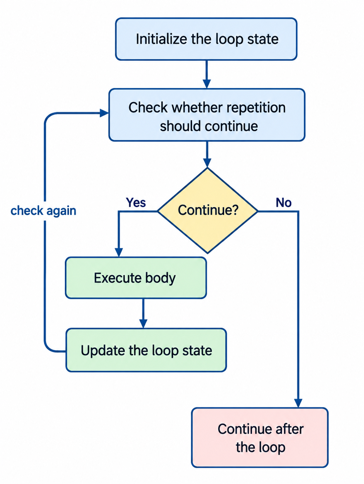

# Lesson 4. Loops

**Last updated:** September 27, 2026

> **Source:** Chapter 4 – *Loops*, in the uploaded *Python for Everyone* textbook by Cay Horstmann and Rance Necaise (2/e).
>
> This lecture follows the structure, terminology, examples, and instructional focus of Chapter 4 while reorganizing the material for direct classroom use. The examples use the textbook's naming conventions and, where formatting is needed, its `%`-style string formatting.

---

## Lesson Introduction

The programs in the previous lesson can make decisions, but each statement is still executed only a limited number of times unless we explicitly repeat it.

Many computational tasks are naturally repetitive. For example, a program may need to:

- update an investment balance year after year;
- read values until the user indicates that there are no more values;
- compute a sum, average, minimum, or maximum over many observations;
- examine every character in a string;
- print a table row by row and column by column;
- repeat a simulation thousands of times.

A **loop** allows a program to execute a block of statements repeatedly.

The central idea of this lesson is:



This chapter develops loop programming gradually. It begins with the `while` loop, introduces hand-tracing and sentinel-controlled input, develops reusable loop algorithms, then introduces the `for` loop, nested loops, string-processing patterns, simulation, and a general problem-solving strategy for complex tasks.

---

## Knowledge and Skills to Be Achieved

After completing this lesson, students will be able to:

- Explain the purpose of iteration in a computer program.
- Implement `while` loops correctly.
- Identify the loop condition, loop body, loop-control variable, initialization, and update.
- Detect common causes of infinite loops.
- Recognize and avoid off-by-one errors.
- Hand-trace loops using a variable table.
- Process input sequences that end with a **sentinel value**.
- Explain the role of a **priming read**.
- Design user interaction with a **storyboard**.
- Apply common loop algorithms for totals, averages, counts, validation, minimums, maximums, and adjacent-value comparisons.
- Use `for` loops to traverse strings and integer ranges.
- Use `range()` with one, two, and three arguments.
- Distinguish **count-controlled** and **event-controlled** loops.
- Design loops systematically from a problem statement.
- Implement nested loops for rows, columns, groups, and repeated subproblems.
- Use `print(..., end="")` when several outputs must appear on the same line.
- Process strings by counting, searching, validating, and constructing new strings.
- Generate pseudorandom values with the `random` module.
- Implement simple simulations and understand the idea of the Monte Carlo method.
- Simplify a difficult programming problem by first solving a smaller version.

---

## Lesson Structure

1. The `while` Loop
2. Problem Solving: Hand-Tracing
3. Application: Processing Sentinel Values
4. Problem Solving: Storyboards
5. Common Loop Algorithms
6. The `for` Loop
7. Nested Loops
8. Processing Strings
9. Application: Random Numbers and Simulations
10. Optional Topic: Digital Image Processing
11. Problem Solving: Solve a Simpler Problem First
12. Summary and Exercises

---

# 4.1 The `while` Loop

A `while` loop repeatedly executes a block of statements **while a condition remains true**.

Consider an investment of `$10,000` that earns `5%` interest per year. We want to determine how many years are required for the investment to double.

A natural algorithm is:

```text
Set the balance to 10000.
Set the year to 0.

While the balance is less than 20000:
    increase the year by 1
    compute the interest
    add the interest to the balance

Report the year.
```

The repeated part is exactly what a `while` loop expresses.

---

## 4.1.1 General Syntax

```python
while condition :
    statements
```

The indented statements form the **loop body**.

The execution pattern is:

1. Evaluate the condition.
2. If it is `True`, execute the body.
3. Return to the condition.
4. Repeat until the condition is `False`.
5. Continue with the first statement after the loop.

Conceptually:

```text
          condition?
          /       \
       True       False
        |            |
    loop body      exit loop
        |
        └──────────→ condition?
```

---

## 4.1.2 Example – Doubling an Investment

```python
##
# This program computes the time required to double an investment.
#

RATE = 5.0
INITIAL_BALANCE = 10000.0
TARGET = 2 * INITIAL_BALANCE

balance = INITIAL_BALANCE
year = 0

while balance < TARGET :
    year = year + 1
    interest = balance * RATE / 100
    balance = balance + interest

print("The investment doubled after", year, "years.")
```

Example output:

```text
The investment doubled after 15 years.
```

Three pieces are essential:

```text
Initialization → Test → Update
```

In this example:

```python
balance = INITIAL_BALANCE      # initialization

while balance < TARGET :       # test
    ...
    balance = balance + interest   # update
```

If the update does not eventually make the condition false, the loop may never terminate.

---

## 4.1.3 Counter-Controlled `while` Loop

A loop can also repeat a known number of times by using a counter.

```python
counter = 1

while counter <= 10 :
    print(counter)
    counter = counter + 1
```

The values printed are:

```text
1
2
3
4
5
6
7
8
9
10
```

The counter follows the pattern:

```text
initialize → check → use → increment → check again
```

---

# Common Error 4.1 – Do Not Think “Are We There Yet?”

A frequent mistake is to write the loop condition as the condition that means the task is **finished**.

Suppose the goal is to continue until the balance reaches the target.

Incorrect idea:

```python
while balance >= TARGET :
    ...
```

If the initial balance is below the target, this condition is false immediately and the loop never executes.

The correct question is:

> Under what condition is the loop still allowed to continue?

Therefore:

```python
while balance < TARGET :
    ...
```

A useful reading rule is:

```text
while <condition for continuing>:
    repeat the work
```

not:

```text
while <condition for being finished>:
```

---

# Common Error 4.2 – Infinite Loops

An **infinite loop** is a loop whose condition never becomes false.

Example:

```python
i = 0

total = 0
while total < 10 :
    i = i + 1
    total = total - i
    print(i, total)
```

Because `total` becomes smaller and smaller, `total < 10` remains true forever.

Another common cause is forgetting to update the loop-control variable:

```python
count = 1

while count <= 10 :
    print(count)
```

`count` never changes, so the loop never terminates.

A useful debugging checklist is:

```text
1. What variable controls the loop?
2. What is its initial value?
3. How does the body change it?
4. Will that change eventually make the condition false?
```

---

# Common Error 4.3 – Off-by-One Errors

An **off-by-one error** occurs when a loop executes one time too many or one time too few.

Compare:

```python
count = 1
while count < 10 :
    print(count)
    count = count + 1
```

with:

```python
count = 1
while count <= 10 :
    print(count)
    count = count + 1
```

The first loop prints `1` through `9`. The second prints `1` through `10`.

Whenever the boundary is important, test values at and near the boundary.

For example, if the intended values are `1` through `10`, check:

```text
first value: 1
last value: 10
number of iterations: 10
```

---

# Computing & Society 4.1 – The First Bug

The chapter uses the historical story of the “first bug” as a reminder that programming errors are not unusual accidents. Debugging is a normal part of programming.

For loop programs, many bugs come from:

- incorrect initialization;
- an incorrect loop condition;
- forgetting an update;
- using `<` when `<=` is required, or vice versa;
- updating a variable in the wrong direction.

The practical lesson is to design loops so that their state changes are easy to inspect and trace.

---

## Self Check 4.1

### Question 1

What values are printed?

```python
n = 1
while n < 20 :
    print(n)
    n = n * 2
```

<details>
<summary>Answer</summary>

```text
1
2
4
8
16
```

After printing `16`, `n` becomes `32`, so the condition is false.

</details>

### Question 2

Why does this loop not execute?

```python
total = 0
while total < 0 :
    print(total)
    total = total + 1
```

<details>
<summary>Answer</summary>

The condition `total < 0` is false before the first iteration because `total` is `0`.

</details>

### Question 3

Identify the problem:

```python
x = 1
while x <= 100 :
    print(x)
```

<details>
<summary>Answer</summary>

`x` is never updated, so the loop is infinite.

</details>

### Question 4

How should this be changed if the intention is to print `1` through `5`?

```python
i = 1
while i < 5 :
    print(i)
    i = i + 1
```

<details>
<summary>Answer</summary>

Use:

```python
while i <= 5 :
```

</details>

---

# 4.2 Problem Solving: Hand-Tracing

Loops can be difficult to understand because the same statements execute repeatedly while variable values change.

**Hand-tracing** means simulating the execution manually, one statement at a time, while recording variable values.

Consider:

```python
n = 1729
total = 0

while n > 0 :
    digit = n % 10
    total = total + digit
    n = n // 10

print(total)
```

A trace table is:

| Iteration | `n` before extraction | `digit` | `total` after addition | `n` after division |
|---:|---:|---:|---:|---:|
| initial | 1729 | | 0 | 1729 |
| 1 | 1729 | 9 | 9 | 172 |
| 2 | 172 | 2 | 11 | 17 |
| 3 | 17 | 7 | 18 | 1 |
| 4 | 1 | 1 | 19 | 0 |

The loop terminates when `n` becomes `0`.

The output is:

```text
19
```

More importantly, tracing reveals the algorithm:

```text
extract the last digit
→ add it to the running total
→ remove the last digit
→ repeat
```

Therefore, the loop computes the sum of the digits of a positive integer.

---

## 4.2.1 How to Hand-Trace a Loop

A practical procedure is:

1. Write one column for each important variable.
2. Record the initial values.
3. Evaluate the loop condition.
4. Execute the body one statement at a time.
5. Record each changed value.
6. Return to the condition.
7. Stop when the condition becomes false.
8. Continue with the statement after the loop.

For loops with output, add an `output` column.

Example:

```python
n = 5
while n >= 0 :
    n = n - 1
    print(n)
```

Trace:

| Test value of `n` | New `n` | Output |
|---:|---:|---:|
| 5 | 4 | 4 |
| 4 | 3 | 3 |
| 3 | 2 | 2 |
| 2 | 1 | 1 |
| 1 | 0 | 0 |
| 0 | -1 | -1 |

The loop executes six times because the test allows `n == 0` to enter the body.

---

## 4.2.2 Hand-Tracing Pseudocode

You do not need working Python code to trace an algorithm.

For example:

```text
r = 1
i = 1
while i <= n
    r = r * a
    i = i + 1
```

For `a = 2` and `n = 4`:

| `i` | `r` after multiplication |
|---:|---:|
| 1 | 2 |
| 2 | 4 |
| 3 | 8 |
| 4 | 16 |

This reveals that the algorithm computes:

```text
r = a^n
```

Tracing pseudocode before implementation is useful because it can expose a flawed algorithm before syntax details are added.

---

## Self Check 4.2

### Question 1

Hand-trace:

```python
n = 1
while n <= 3 :
    print(n)
    n = n + 1
```

<details>
<summary>Answer</summary>

The output is:

```text
1
2
3
```

</details>

### Question 2

What problem occurs here?

```python
n = 1
while n != 50 :
    print(n)
    n = n + 10
```

<details>
<summary>Answer</summary>

`n` takes the values `1, 11, 21, 31, 41, 51, ...` and never becomes `50`. The loop is infinite.

</details>

### Question 3

Why can hand-tracing be more informative than only running the program?

<details>
<summary>Answer</summary>

Because tracing shows how each variable changes and why the loop behaves as it does. It helps reveal the general algorithm and locate the step where incorrect behavior begins.

</details>

---

# 4.3 Application: Processing Sentinel Values

Many programs process a sequence whose length is not known in advance.

Examples include:

- salaries entered by a user;
- measurements collected until a stop signal appears;
- transaction values entered until the operator finishes;
- scores entered until there are no more students.

The program needs a way to recognize the end of the sequence.

A **sentinel value** is a special value that marks the end of input but is **not part of the data**.

Examples:

```text
0     when valid data can never be zero
-1    when valid data can never be negative
"Q"   when numeric values are expected as text
""    when an empty line can mean “finished”
```

---

## 4.3.1 Example – Average Salary with a Sentinel

Suppose negative salaries are impossible. We can use a negative number as the sentinel.

```python
total = 0.0
count = 0
salary = 0.0

while salary >= 0.0 :
    salary = float(input("Enter a salary or -1 to finish: "))

    if salary >= 0.0 :
        total = total + salary
        count = count + 1

if count > 0 :
    average = total / count
    print("Average salary is", average)
else :
    print("No data was entered.")
```

The sentinel must **not** be included in the total or the count.

Example:

```text
Enter a salary or -1 to finish: 10000
Enter a salary or -1 to finish: 10000
Enter a salary or -1 to finish: 40000
Enter a salary or -1 to finish: -1
Average salary is 20000.0
```

---

## 4.3.2 Priming Read

The preceding solution initializes `salary` with an arbitrary non-sentinel value.

Another common pattern is to read the first value **before** the loop.

```python
salary = float(input("Enter a salary or -1 to finish: "))

while salary >= 0.0 :
    total = total + salary
    count = count + 1
    salary = float(input("Enter a salary or -1 to finish: "))
```

The first input operation is called a **priming read** because it provides the initial value needed to test the loop condition.

Pattern:

```text
read first value
while value is not sentinel
    process value
    read next value
```

This is one of the most important input-processing loop patterns in introductory programming.

---

## 4.3.3 Sentinel with Text Input

Suppose the user enters numbers or the letter `Q` to quit.

```python
inputStr = input("Enter a value or Q to quit: ")

while inputStr != "Q" :
    value = float(inputStr)
    print("Value:", value)
    inputStr = input("Enter a value or Q to quit: ")
```

A more robust version can normalize case:

```python
inputStr = input("Enter a value or Q to quit: ")

while inputStr.upper() != "Q" :
    value = float(inputStr)
    print("Value:", value)
    inputStr = input("Enter a value or Q to quit: ")
```

At this stage, if the user enters an unexpected nonnumeric string such as `hello`, conversion still fails. Exception handling is introduced later.

---

# Special Topic 4.1 – Sentinel Values with a Boolean Variable

A Boolean variable can represent whether processing is finished.

```python
done = False

while not done :
    value = float(input("Enter a salary or -1 to finish: "))

    if value < 0.0 :
        done = True
    else :
        # Process value.
        print(value)
```

Here, the decision to stop occurs inside the loop body rather than entirely at the top.

The textbook describes this pattern as a **loop and a half**.

Python also provides `break`:

```python
while True :
    value = float(input("Enter a salary or -1 to finish: "))

    if value < 0.0 :
        break

    print(value)
```

The textbook notes this construct but avoids relying on `break` in its main instructional style. For this course, the condition-controlled form is generally preferable when it can be expressed clearly.

---

# Special Topic 4.2 – Input and Output Redirection

A program that reads from standard input can often receive the same input from a file at the operating-system command line.

Conceptually:

```text
keyboard → program
```

can become:

```text
file → program
```

For example:

```text
python sentinel.py < numbers.txt
```

Likewise, output can be redirected:

```text
python sentinel.py < numbers.txt > output.txt
```

Input redirection is especially useful for testing because the same test data can be reused without typing it again.

---

## Self Check 4.3

### Question 1

Why should the sentinel not be included in the total?

<details>
<summary>Answer</summary>

Because the sentinel is a control signal indicating the end of the sequence. It is not one of the actual data values.

</details>

### Question 2

What happens if this initialization is used?

```python
salary = -1
while salary >= 0 :
    ...
```

<details>
<summary>Answer</summary>

The condition is false immediately, so the loop body never executes.

</details>

### Question 3

What is the role of a priming read?

<details>
<summary>Answer</summary>

It obtains the first input value before the loop so that the loop condition can be tested correctly.

</details>

---

# 4.4 Problem Solving: Storyboards

When a program interacts repeatedly with a user, the algorithm is not only about calculations. It also has an **interaction flow**.

Before coding, you should decide:

- what the program asks the user;
- in what order inputs are requested;
- how results are displayed;
- what happens for invalid input;
- how repeated operations are started;
- how the user exits the program.

A **storyboard** is a sequence of annotated interaction panels that shows how a user and a program communicate.

---

## 4.4.1 Example – Unit Conversion

Suppose a program converts values from one unit to another.

A first storyboard might be:

```text
What unit do you want to convert from? cm
What unit do you want to convert to? in
Enter values, terminated by zero
30
30 cm = 11.81 in
100
100 cm = 39.37 in
0
```

This reveals several design decisions:

- the user chooses a source unit;
- the user chooses a destination unit;
- several values can be converted in one session;
- `0` terminates the current sequence.

But it also raises questions:

```text
What unit names are accepted?
What happens for an unknown unit?
What happens if the two units are incompatible?
How does the user request another conversion?
How does the program terminate completely?
```

These questions are easier to notice in a storyboard than after the program has already been implemented.

---

## 4.4.2 Error-Handling Panel

A poor interaction might be:

```text
From unit: cm
To unit: inches
Sorry, unknown unit.
To unit: inch
Sorry, unknown unit.
```

A better design can show the accepted unit codes:

```text
From unit (in, ft, mi, mm, cm, m, km, oz, lb, g, kg, tsp, tbsp, pint, gal): cm
To unit: in
```

The important programming lesson is that interface design affects the structure of loops and decisions.

---

## 4.4.3 Designing Termination

A complete interaction might include:

```text
From unit: cm
To unit: in
Enter values, terminated by zero
30
30 cm = 11.81 in
0
More conversions (y, n)? n
```

The sentinel `0` ends one **sequence of values**, while `n` ends the entire program.

This may lead to two levels of repetition:

```text
outer loop: repeat conversion sessions
    inner loop: convert values until sentinel
```

Storyboarding can therefore reveal the need for nested loops before code is written.

---

## Self Check 4.4

### Question 1

Why is a storyboard useful before writing the algorithm?

<details>
<summary>Answer</summary>

It clarifies required inputs, outputs, error cases, repeated interactions, and termination behavior. Those decisions determine the structure of the program.

</details>

### Question 2

Suppose a program reads test scores and prints one average. What should a minimal storyboard show?

<details>
<summary>Sample Answer</summary>

```text
Enter score or -1 to finish: 80
Enter score or -1 to finish: 90
Enter score or -1 to finish: 70
Enter score or -1 to finish: -1
Average score: 80.00
```

</details>

---

# 4.5 Common Loop Algorithms

Many loop problems look different on the surface but use the same underlying pattern.

Learning a small set of standard loop algorithms makes it easier to design new programs.

The chapter emphasizes these patterns:

1. sum and average;
2. counting matches;
3. prompting until a valid value is found;
4. maximum and minimum;
5. comparing adjacent values.

---

## 4.5.1 Sum and Average

To compute a sum, maintain a **running total**.

```python
total = 0.0
inputStr = input("Enter value: ")

while inputStr != "" :
    value = float(inputStr)
    total = total + value
    inputStr = input("Enter value: ")
```

The total must be initialized **before** the loop.

Pattern:

```text
total = 0
for each value
    total = total + value
```

To compute an average, we also need a count:

```python
total = 0.0
count = 0
inputStr = input("Enter value: ")

while inputStr != "" :
    value = float(inputStr)
    total = total + value
    count = count + 1
    inputStr = input("Enter value: ")

if count > 0 :
    average = total / count
else :
    average = 0.0
```

The division must occur **after** the loop because the complete total and count are required.

---

## 4.5.2 Counting Matches

To count how many values satisfy a condition, initialize a counter to zero and increment it when a match is found.

Example – count negative values:

```python
negatives = 0
inputStr = input("Enter value: ")

while inputStr != "" :
    value = int(inputStr)

    if value < 0 :
        negatives = negatives + 1

    inputStr = input("Enter value: ")

print("There were", negatives, "negative values.")
```

Pattern:

```text
count = 0
for each value
    if value matches condition
        count = count + 1
```

This pattern appears frequently in data analysis.

Examples:

- number of passing grades;
- number of late deliveries;
- number of transactions above a threshold;
- number of uppercase letters in a string.

---

## 4.5.3 Prompting Until a Match Is Found

In Lesson 3, invalid input could cause an error message and termination.

A better interaction is often to continue asking until valid input is supplied.

Example:

```python
valid = False

while not valid :
    value = int(input("Please enter a positive value < 100: "))

    if value > 0 and value < 100 :
        valid = True
    else :
        print("Invalid input.")
```

Pattern:

```text
valid = False
while not valid
    read input
    if input is valid
        valid = True
    else
        report error
```

This is an **event-controlled loop** because the number of iterations is not known in advance.

---

## 4.5.4 Maximum and Minimum

To find a maximum, keep the largest value seen so far.

A correct initialization is important.

```python
largest = int(input("Enter a value: "))
inputStr = input("Enter a value: ")

while inputStr != "" :
    value = int(inputStr)

    if value > largest :
        largest = value

    inputStr = input("Enter a value: ")
```

Similarly, the minimum is:

```python
smallest = int(input("Enter a value: "))
inputStr = input("Enter a value: ")

while inputStr != "" :
    value = int(inputStr)

    if value < smallest :
        smallest = value

    inputStr = input("Enter a value: ")
```

A common mistake is:

```python
smallest = 0
```

This fails when all input values are positive because no value may be smaller than `0`.

A reliable strategy is:

```text
read the first actual data value
use it as the initial minimum/maximum
then process the remaining values
```

---

## 4.5.5 Comparing Adjacent Values

Sometimes the current value must be compared with the immediately preceding value.

Example goal: detect adjacent duplicates.

Incorrect idea:

```text
read current value
compare it with previous value
```

The problem is that the previous value may have already been overwritten.

Instead, preserve it explicitly:

```python
value = int(input("Enter a value: "))
inputStr = input("Enter a value: ")

while inputStr != "" :
    previous = value
    value = int(inputStr)

    if value == previous :
        print("Duplicate input")

    inputStr = input("Enter a value: ")
```

Pattern:

```text
previous = first value
for each next value
    compare next value with previous
    previous = next value
```

This idea is useful for:

- detecting repeated measurements;
- checking whether a sequence is increasing;
- computing changes between consecutive periods;
- detecting sign changes;
- comparing current demand with previous demand.

---

## Example – Processing Grades

Several standard loop patterns can be combined in one program.

```python
numPassing = 0
numFailing = 0

total = 0.0
count = 0

grade = float(input("Enter a grade or -1 to finish: "))

if grade >= 0 :
    minGrade = grade
    maxGrade = grade

while grade >= 0.0 :
    if grade >= 60.0 :
        numPassing = numPassing + 1
    else :
        numFailing = numFailing + 1

    if grade < minGrade :
        minGrade = grade

    if grade > maxGrade :
        maxGrade = grade

    total = total + grade
    count = count + 1

    grade = float(input("Enter a grade or -1 to finish: "))

if count > 0 :
    average = total / count
    print("The average grade is %.2f" % average)
    print("Number of passing grades is", numPassing)
    print("Number of failing grades is", numFailing)
    print("The maximum grade is %.2f" % maxGrade)
    print("The minimum grade is %.2f" % minGrade)
```

The key idea is that one loop can update several summary variables during the same traversal of the data.

---

## Self Check 4.5

### Question 1

Why is `total` usually initialized to `0`?

<details>
<summary>Answer</summary>

Zero is the neutral starting value for addition. Adding the first data value to zero preserves that value correctly.

</details>

### Question 2

Why should a minimum normally not be initialized to `0`?

<details>
<summary>Answer</summary>

If all data values are positive, `0` would incorrectly remain the minimum even though it was never part of the data.

</details>

### Question 3

What two variables are needed to compute an average incrementally?

<details>
<summary>Answer</summary>

A running `total` and a `count` of processed values.

</details>

### Question 4

What extra information is needed to compare adjacent values?

<details>
<summary>Answer</summary>

The previous value must be stored so that it is still available when the next value is read.

</details>

---

# 4.6 The `for` Loop

A `for` loop is convenient when a program needs to iterate through the elements of a container or through a known range of integer values.

---

## 4.6.1 Iterating over a String

```python
stateName = "Virginia"

for letter in stateName :
    print(letter)
```

Output:

```text
V
i
r
g
i
n
i
a
```

Read the loop as:

> For each `letter` in `stateName`, execute the body.

The loop variable contains the **element itself**, not its index.

Equivalent `while` loop:

```python
i = 0

while i < len(stateName) :
    letter = stateName[i]
    print(letter)
    i = i + 1
```

The `for` form is shorter when the index is not needed.

---

## 4.6.2 General Syntax

```python
for variable in container :
    statements
```

The body executes once for each element in the container.

At the beginning of each iteration, `variable` receives the next element.

---

## 4.6.3 `range()` with Two Arguments

```python
for i in range(1, 10) :
    print(i)
```

Values of `i`:

```text
1, 2, 3, 4, 5, 6, 7, 8, 9
```

The second argument is **not included**.

General rule:

```python
range(start, stop)
```

produces:

```text
start, start + 1, ..., stop - 1
```

---

## 4.6.4 `range()` with Three Arguments

The third argument is the step.

```python
for i in range(1, 10, 2) :
    print(i)
```

Output:

```text
1
3
5
7
9
```

Counting downward:

```python
for i in range(10, 0, -1) :
    print(i)
```

Output:

```text
10
9
8
7
6
5
4
3
2
1
```

---

## 4.6.5 `range()` with One Argument

```python
for i in range(5) :
    print(i)
```

Output:

```text
0
1
2
3
4
```

Therefore:

```python
range(n)
```

produces integers from:

```text
0 to n - 1
```

This form is useful when the body simply needs to execute `n` times.

Example:

```python
for i in range(10) :
    print("Hello")
```

The message is printed ten times.

---

## 4.6.6 Example – Investment Table

When the number of years is known in advance, a `for` loop is natural.

```python
RATE = 5.0
INITIAL_BALANCE = 10000.0

numYears = int(input("Enter number of years: "))

balance = INITIAL_BALANCE

for year in range(1, numYears + 1) :
    interest = balance * RATE / 100
    balance = balance + interest
    print("%4d %10.2f" % (year, balance))
```

Notice:

```python
range(1, numYears + 1)
```

is needed because the upper bound of `range()` is excluded.

---

# Programming Tip 4.1 – Count Iterations

When loop bounds are confusing, count how many iterations the loop should execute.

For:

```python
for i in range(a, b) :
    ...
```

the number of iterations is:

```text
b - a
```

For example:

```python
range(3, 8)
```

contains:

```text
3, 4, 5, 6, 7
```

There are:

```text
8 - 3 = 5
```

values.

For an inclusive mathematical interval from `a` through `b`, the number of integers is:

```text
b - a + 1
```

That extra `+1` is a classic source of fence-post and off-by-one errors.

---

# HOW TO 4.1 – Writing a Loop

The chapter proposes a systematic way to design loops.

Suppose we read twelve monthly temperatures and want to report the month with the highest temperature.

---

## Step 1. Decide what work belongs inside the loop

Do the task manually for a few values.

A general repeated action is:

```text
Read the next temperature.
If it is larger than the highest temperature seen so far:
    update the highest temperature
    update the month of the highest temperature
```

---

## Step 2. Specify the loop condition or repetition count

Ask what determines completion.

Typical possibilities are:

- a counter reaches its final value;
- a sentinel is read;
- a valid value is entered;
- a threshold is reached.

Here, there are exactly twelve months.

---

## Step 3. Determine the loop type

Two major categories are:

### Count-controlled loop

The number of iterations is known in advance.

Typical Python form:

```python
for ... in range(...) :
```

### Event-controlled loop

The number of iterations is not known in advance. Repetition stops when an event occurs.

Typical Python form:

```python
while condition :
```

Examples of events:

```text
sentinel entered
valid input found
target balance reached
user chooses to quit
```

---

## Step 4. Set up variables before the loop

The first temperature is a good initial maximum.

```python
highestValue = float(input("Enter a value: "))
highestMonth = 1
```

Then process months `2` through `12`.

---

## Step 5. Process the result after the loop

The loop updates the variables needed for the answer.

After the loop:

```python
print(highestMonth)
```

---

## Step 6. Trace the loop with a small example

Instead of tracing all twelve months, test with four values such as:

```text
22.6, 36.6, 44.5, 24.2
```

Trace:

| Current month | Current value | Highest month | Highest value |
|---:|---:|---:|---:|
| 1 | 22.6 | 1 | 22.6 |
| 2 | 36.6 | 2 | 36.6 |
| 3 | 44.5 | 3 | 44.5 |
| 4 | 24.2 | 3 | 44.5 |

---

## Step 7. Implement the loop

```python
highestValue = float(input("Enter a value: "))
highestMonth = 1

for currentMonth in range(2, 13) :
    nextValue = float(input("Enter a value: "))

    if nextValue > highestValue :
        highestValue = nextValue
        highestMonth = currentMonth

print(highestMonth)
```

The key skill is recognizing the repeated action and choosing the correct loop type.

---

## Self Check 4.6

### Question 1

What values does this produce?

```python
for i in range(6) :
    print(i)
```

<details>
<summary>Answer</summary>

```text
0, 1, 2, 3, 4, 5
```

</details>

### Question 2

What values does this produce?

```python
for i in range(10, 16) :
    print(i)
```

<details>
<summary>Answer</summary>

```text
10, 11, 12, 13, 14, 15
```

</details>

### Question 3

Write a loop that prints the even integers from `10` through `20`, inclusive.

<details>
<summary>Answer</summary>

```python
for i in range(10, 21, 2) :
    print(i)
```

</details>

### Question 4

Should a loop that continues until an investment doubles normally use `for` or `while`?

<details>
<summary>Answer</summary>

Usually `while`, because the number of years is not known in advance. The loop stops when the balance reaches a target event.

</details>

---

# 4.7 Nested Loops

A **nested loop** is a loop inside the body of another loop.

Nested loops arise naturally when a task has two levels of repetition.

Examples:

- rows and columns of a table;
- students and exams for each student;
- days and transactions within each day;
- products and monthly sales values;
- coordinates in a grid.

---

## 4.7.1 Example – Table of Powers

Suppose we want to print values of $x^n$ for:

```text
x = 1, 2, ..., 10
n = 1, 2, 3, 4
```

The outer loop handles rows:

```text
for each x
    print one row
```

The inner loop handles columns:

```text
for each n
    print x^n
```

Combined:

```python
for x in range(1, 11) :
    for n in range(1, 5) :
        print("%10.0f" % (x ** n), end="")
    print()
```

For every one iteration of the outer loop, the inner loop executes completely.

Total number of printed values:

```text
10 rows × 4 columns = 40 values
```

---

## 4.7.2 Understanding the Execution Order

For:

```python
for i in range(3) :
    for j in range(4) :
        print(i, j)
```

execution begins as:

```text
i = 0, j = 0
i = 0, j = 1
i = 0, j = 2
i = 0, j = 3

i = 1, j = 0
i = 1, j = 1
...
```

The inner loop restarts from its beginning for each new outer-loop value.

---

## 4.7.3 Pattern Examples

### Rectangle

```python
for i in range(3) :
    for j in range(4) :
        print("*", end="")
    print()
```

Output:

```text
****
****
****
```

### Triangle

```python
for i in range(4) :
    for j in range(i + 1) :
        print("*", end="")
    print()
```

Output:

```text
*
**
***
****
```

The number of inner-loop iterations can depend on the current outer-loop value.

---

# Special Topic 4.3 – Special Form of `print`

Normally, `print()` starts a new line after displaying its arguments.

```python
print("A")
print("B")
```

Output:

```text
A
B
```

To keep the next output on the same line:

```python
print("A", end="")
print("B")
```

Output:

```text
AB
```

The `end` argument specifies what is printed after the normal output.

Examples:

```python
print("A", end=" ")
print("B")
```

Output:

```text
A B
```

This is particularly useful in nested loops that construct one row through several `print` calls.

---

# Worked Example 4.1 – Average Exam Grades

## Problem Statement

Compute the average exam grade for multiple students. Each student has the same number of exam grades.

The structure contains two levels of repetition:

```text
repeat for each student
    repeat for each exam of that student
```

The inner loop computes one student's total.

The outer loop allows another student's grades to be entered.

---

## Step 1. Read the number of exams

```python
numExams = int(input("How many exam grades does each student have? "))
```

---

## Step 2. Compute one student's average

```python
total = 0

for i in range(1, numExams + 1) :
    score = int(input("Exam %d: " % i))
    total = total + score

average = total / numExams
print("The average is %.2f" % average)
```

---

## Step 3. Repeat for additional students

Because the number of students is unknown, use an event-controlled outer loop.

```python
moreGrades = "Y"

while moreGrades == "Y" :
    # Process one student.
    ...

    moreGrades = input("Enter exam grades for another student (Y/N)? ")
    moreGrades = moreGrades.upper()
```

---

## Complete Program

```python
numExams = int(input("How many exam grades does each student have? "))

moreGrades = "Y"

while moreGrades == "Y" :
    print("Enter the exam grades.")

    total = 0

    for i in range(1, numExams + 1) :
        score = int(input("Exam %d: " % i))
        total = total + score

    average = total / numExams
    print("The average is %.2f" % average)

    moreGrades = input("Enter exam grades for another student (Y/N)? ")
    moreGrades = moreGrades.upper()
```

This example combines:

- an event-controlled `while` loop;
- a count-controlled `for` loop;
- a running total;
- input normalization with `upper()`.

---

# Worked Example 4.2 – Grade Distribution Histogram

The textbook uses a grade-distribution histogram as an example of combining loop-based counting with plotting.

The important non-graphics algorithm is the grade tally.

Initialize counters:

```python
numAs = 0
numBs = 0
numCs = 0
numDs = 0
numFs = 0
```

For each grade:

```python
if grade >= 90 :
    numAs = numAs + 1
elif grade >= 80 :
    numBs = numBs + 1
elif grade >= 70 :
    numCs = numCs + 1
elif grade >= 60 :
    numDs = numDs + 1
else :
    numFs = numFs + 1
```

After all grades are processed, the counters summarize the distribution.

This illustrates a general data-processing pattern:

```text
initialize category counters
→ read each observation
→ classify the observation
→ increment one counter
→ report the distribution
```

The same pattern can be used for:

- customer ratings;
- delivery-delay categories;
- sales ranges;
- age groups;
- defect categories.

---

## Self Check 4.7

### Question 1

How many times is the inner body executed?

```python
for i in range(3) :
    for j in range(5) :
        print("*", end="")
```

<details>
<summary>Answer</summary>

`3 × 5 = 15` times.

</details>

### Question 2

What does this print?

```python
for i in range(3) :
    for j in range(1, 4) :
        print(i + j, end="")
    print()
```

<details>
<summary>Answer</summary>

```text
123
234
345
```

</details>

### Question 3

Why is `end=""` often used in the inner loop?

<details>
<summary>Answer</summary>

Because the inner loop usually builds one row by printing several items on the same line. The outer loop then calls `print()` to move to the next row.

</details>

---

# 4.8 Processing Strings

Loops are frequently used to examine or transform strings.

Common tasks include:

- counting matching characters;
- finding all positions where a condition is true;
- finding the first or last match;
- validating a required format;
- building a new string from selected or transformed characters.

---

## 4.8.1 Counting Matches

Example – count uppercase letters:

```python
uppercase = 0

for char in string :
    if char.isupper() :
        uppercase = uppercase + 1
```

The same counting pattern from Section 4.5 works because a string is a sequence of characters.

Example – count vowels:

```python
vowels = 0

for char in word :
    if char.lower() in "aeiou" :
        vowels = vowels + 1
```

Using `lower()` allows one test to handle both uppercase and lowercase vowels.

---

## 4.8.2 Finding All Matches

If only the character matters:

```python
for char in text :
    ...
```

If the **position** of each match is needed, iterate over indices:

```python
sentence = input("Enter a sentence: ")

for i in range(len(sentence)) :
    if sentence[i].isupper() :
        print(i)
```

The choice is:

```text
Need only elements?   → for element in string
Need positions?       → for i in range(len(string))
```

---

## 4.8.3 Finding the First Match

If the goal is to find the first match, there is no need to scan the rest of the string after a match is found.

Example – first digit:

```python
found = False
position = 0

while not found and position < len(string) :
    if string[position].isdigit() :
        found = True
    else :
        position = position + 1

if found :
    print("First digit occurs at position", position)
else :
    print("The string does not contain a digit.")
```

The loop has two reasons to terminate:

```text
a match is found
OR
there are no more characters
```

Therefore the continuation condition requires both:

```python
not found and position < len(string)
```

---

## 4.8.4 Finding the Last Match

One approach is to search backward.

```python
found = False
position = len(string) - 1

while not found and position >= 0 :
    if string[position].isdigit() :
        found = True
    else :
        position = position - 1
```

Starting at the last valid index allows the first match encountered during the backward scan to be the last match in the original string.

---

## 4.8.5 Validating a String

A string may need to satisfy a structural format rather than only a single-value condition.

For example, suppose a phone number must use the form:

```text
(###)###-####
```

The string must:

- have length `13`;
- contain `(` at position `0`;
- contain `)` at position `4`;
- contain `-` at position `8`;
- contain digits in all remaining positions.

One loop-based validator is:

```python
valid = len(string) == 13
position = 0

while valid and position < len(string) :
    if position == 0 :
        valid = string[position] == "("
    elif position == 4 :
        valid = string[position] == ")"
    elif position == 8 :
        valid = string[position] == "-"
    else :
        valid = string[position].isdigit()

    position = position + 1

if valid :
    print("The string contains a valid phone number.")
else :
    print("The string does not contain a valid phone number.")
```

The loop stops early if `valid` becomes `False`.

This is a common validation pattern:

```text
assume valid
scan each required component
if one component violates the rule
    mark invalid
stop when invalid or finished
```

---

## 4.8.6 Building a New String

Strings cannot be modified character by character in place, but a new string can be built by concatenation.

Example – remove spaces and dashes from a credit-card-style input:

```python
userInput = input("Enter a credit card number: ")
creditCardNumber = ""

for char in userInput :
    if char != " " and char != "-" :
        creditCardNumber = creditCardNumber + char
```

If the input is:

```text
4123-5678-9012-3450
```

then the result becomes:

```text
4123567890123450
```

---

## 4.8.7 Character Transformation

Example – swap letter case:

```python
newString = ""

for char in original :
    if char.isupper() :
        newChar = char.lower()
    elif char.islower() :
        newChar = char.upper()
    else :
        newChar = char

    newString = newString + newChar
```

Pattern:

```text
newString = empty
for each character in original
    determine what should be appended
    append to newString
```

This generalizes to many text-cleaning tasks.

---

## Example – Grading Multiple-Choice Answers

Suppose the official answers are:

```python
CORRECT_ANSWERS = "adbdcacbdac"
```

First validate that the student entered the correct number of answers:

```python
done = False

while not done :
    userAnswers = input("Enter your exam answers: ")

    if len(userAnswers) == len(CORRECT_ANSWERS) :
        done = True
    else :
        print("Error: an incorrect number of answers given.")
```

Then compare corresponding positions:

```python
correct = 0

for i in range(len(CORRECT_ANSWERS)) :
    if userAnswers[i] == CORRECT_ANSWERS[i] :
        correct = correct + 1
```

This combines:

- validation loops;
- string indexing;
- `range(len(...))`;
- counting matches.

---

## Self Check 4.8

### Question 1

How do you count digits in `text`?

<details>
<summary>Answer</summary>

```python
digits = 0
for char in text :
    if char.isdigit() :
        digits = digits + 1
```

</details>

### Question 2

When should you prefer `for char in text` over `for i in range(len(text))`?

<details>
<summary>Answer</summary>

Use `for char in text` when only the characters themselves are needed. Use indices when positions are required.

</details>

### Question 3

Why does a first-match search commonly use a `while` loop?

<details>
<summary>Answer</summary>

Because the number of examined characters is not known in advance. The search can stop as soon as the match is found.

</details>

### Question 4

What should `newString` be initialized to when building a string character by character?

<details>
<summary>Answer</summary>

```python
newString = ""
```

</details>

---

# 4.9 Application: Random Numbers and Simulations

A **simulation** uses a computer program to imitate the behavior of a real or imagined system.

Simulations are useful when:

- exact outcomes are uncertain;
- repeated experiments would be expensive or slow;
- the long-run behavior is more important than one individual outcome;
- a model can represent important aspects of the system.

Loops are central to simulation because the program usually repeats the same experiment many times.

---

## 4.9.1 Generating Random Numbers

Python's `random` module provides pseudorandom numbers.

```python
from random import random
```

Calling:

```python
random()
```

produces a floating-point value satisfying:

```text
0 <= value < 1
```

Example:

```python
from random import random

for i in range(10) :
    value = random()
    print(value)
```

The values differ from run to run.

They are called **pseudorandom** because they are produced algorithmically even though their behavior is designed to resemble randomness.

---

## 4.9.2 Random Integers

For a random integer in an inclusive range, use:

```python
from random import randint
```

Then:

```python
randint(a, b)
```

returns an integer from `a` through `b`, including both endpoints.

Example – one die:

```python
die = randint(1, 6)
```

Example – two dice:

```python
from random import randint

for i in range(10) :
    d1 = randint(1, 6)
    d2 = randint(1, 6)
    print(d1, d2)
```

---

## 4.9.3 Simulating Repeated Events

Suppose we want to estimate the probability of rolling a total of `7` with two dice.

```python
from random import randint

TRIES = 10000
hits = 0

for i in range(TRIES) :
    d1 = randint(1, 6)
    d2 = randint(1, 6)

    if d1 + d2 == 7 :
        hits = hits + 1

probability = hits / TRIES
print(probability)
```

This program uses familiar loop patterns:

```text
repeat an experiment many times
→ test whether the outcome matches a condition
→ count matches
→ divide matches by number of trials
```

---

## 4.9.4 The Monte Carlo Method

A **Monte Carlo method** estimates a quantity by repeated random sampling.

The textbook illustrates the idea by estimating $\pi$.

Imagine randomly generating points in the square:

```text
-1 <= x < 1
-1 <= y < 1
```

A point is inside the unit circle when:

$$
x^2 + y^2 \leq 1.
$$

The area of the unit circle is:

$$
\pi.
$$

The area of the surrounding square is:

$$
4.
$$

Therefore:

$$
\frac{\text{hits}}{\text{tries}} \approx \frac{\pi}{4}.
$$

So:

$$
\pi \approx 4\frac{\text{hits}}{\text{tries}}.
$$

---

## 4.9.5 Generating a Random Floating-Point Number in an Interval

If:

```python
r = random()
```

then:

```text
0 <= r < 1
```

To transform it to:

```text
a <= x < b
```

use:

```python
x = a + (b - a) * r
```

For the interval `[-1, 1)`:

```python
x = -1 + 2 * random()
y = -1 + 2 * random()
```

---

## 4.9.6 Monte Carlo Estimate of Pi

```python
from random import random

TRIES = 10000
hits = 0

for i in range(TRIES) :
    x = -1 + 2 * random()
    y = -1 + 2 * random()

    if x * x + y * y <= 1 :
        hits = hits + 1

piEstimate = 4.0 * hits / TRIES
print("Estimated pi:", piEstimate)
```

Increasing `TRIES` usually improves stability, although a simulation result remains approximate.

The conceptual importance of this example is larger than the particular estimate of $\pi$:

```text
random experiment
→ repeat many times
→ collect statistics
→ infer a quantity from the statistics
```

---

## Self Check 4.9

### Question 1

What interval does `random()` use?

<details>
<summary>Answer</summary>

```text
0 <= value < 1
```

</details>

### Question 2

What values can `randint(1, 6)` return?

<details>
<summary>Answer</summary>

Any integer from `1` through `6`, inclusive.

</details>

### Question 3

What loop pattern appears in many simulations?

<details>
<summary>Answer</summary>

Repeat a random experiment many times, count or accumulate outcomes, and summarize the results after the loop.

</details>

### Question 4

Why is a Monte Carlo result usually approximate?

<details>
<summary>Answer</summary>

It is based on a finite random sample. Different runs can produce slightly different results, and the estimate approaches the theoretical value only statistically as the number of trials grows.

</details>

---

# 4.10 Optional Topic: Digital Image Processing

The textbook uses digital image processing as an optional application of nested loops.

A digital image can be viewed as a rectangular grid of pixels.

Conceptually:

```text
for each row
    for each column
        read or modify the pixel at that position
```

This is another natural application of nested loops because an image has two spatial dimensions.

Typical operations include:

- filtering pixels;
- modifying brightness or color components;
- copying pixels into a new image;
- flipping or reconfiguring an image.

The loop structure is the main idea for this lesson:

```python
for row in range(height) :
    for col in range(width) :
        # Process pixel at (row, col)
        ...
```

Library-specific image-processing methods are optional and are not required for the core loop outcomes of this course.

---

# 4.11 Problem Solving: Solve a Simpler Problem First

As programming problems become larger, it can be difficult to design the complete solution immediately.

A powerful strategy is:

> First solve a simpler version of the problem, then extend the solution gradually.

This strategy helps because:

- the smaller task is easier to reason about;
- each version gives a working checkpoint;
- the repeated structure becomes clearer;
- errors are easier to isolate;
- the final solution grows from tested pieces instead of appearing all at once.

---

## 4.11.1 Progressive Simplification

Suppose the final task requires arranging many objects in rows, wrapping to a new row when there is no more room.

Instead of solving everything at once:

```text
1. Place one object.
2. Place two objects next to each other.
3. Add a gap between objects.
4. Place several objects in one row.
5. Fill a row until no more objects fit.
6. Start a new row.
7. Continue until all objects are placed.
```

Each step is a small extension of the previous one.

This often reveals the necessary loop state:

```text
current x-position
current y-position
object width
horizontal gap
row height
available width
```

---

## 4.11.2 Applying the Strategy to Basic Programming

### Example – Sum of Digits

Instead of immediately solving “sum all digits of an arbitrary integer”, solve:

```text
How do I obtain the last digit?
```

Answer:

```python
digit = n % 10
```

Then:

```text
How do I remove the last digit?
```

Answer:

```python
n = n // 10
```

Then repeat:

```python
total = 0

while n > 0 :
    digit = n % 10
    total = total + digit
    n = n // 10
```

The complete loop grows from two simpler operations.

---

## 4.11.3 A General Simplification Workflow

```text
State the full problem
        ↓
Remove one difficult requirement
        ↓
Solve the simpler problem
        ↓
Understand the repeated pattern
        ↓
Add one requirement back
        ↓
Test again
        ↓
Continue until the full problem is solved
```

This is especially useful for:

- nested loops;
- formatted output;
- grid processing;
- simulations;
- programs with several interaction stages.

---

# Computing & Society 4.2 – Digital Piracy

The chapter closes with a discussion of digital piracy as a computing-and-society topic.

For this programming lesson, the broader connection is that software makes copying, distribution, and repeated processing of digital information extremely easy. Technical capability and appropriate use are separate questions. Programmers should recognize that legal, ethical, licensing, and ownership considerations may apply to digital data and software.

---

# Chapter 4 Summary

## `while` Loops

A `while` loop repeats a block while a condition is true.

```python
while condition :
    statements
```

A correct loop usually requires:

```text
initialization
→ condition
→ repeated work
→ update
→ eventual termination
```

Common errors include:

- testing for the finished state instead of the continuation state;
- failing to update the loop variable;
- updating in the wrong direction;
- using the wrong boundary operator;
- creating an infinite loop.

---

## Hand-Tracing

Hand-tracing records variable changes one iteration at a time.

Use it to:

- understand unfamiliar algorithms;
- verify loop bounds;
- find infinite-loop causes;
- locate logic errors;
- test pseudocode before implementation.

---

## Sentinel-Controlled Input

A sentinel marks the end of a sequence but is not data.

Typical pattern:

```python
value = input(...)

while value != sentinel :
    process(value)
    value = input(...)
```

The first read before the loop is a **priming read**.

---

## Storyboards

A storyboard plans user interaction before implementation.

It can reveal:

- necessary inputs;
- repeated sessions;
- sentinel choices;
- error cases;
- output formats;
- termination behavior;
- the need for nested loops.

---

## Common Loop Algorithms

### Running total

```python
total = 0
for each value :
    total = total + value
```

### Average

```text
maintain total and count
average = total / count
```

### Count matches

```python
count = 0
for each value :
    if condition :
        count = count + 1
```

### Prompt until valid

```python
valid = False
while not valid :
    ...
```

### Maximum / minimum

Initialize with an actual data value, then update when a better candidate appears.

### Adjacent comparison

Keep the previous value in a separate variable.

---

## `for` Loops

Iterating over elements:

```python
for char in text :
    ...
```

Iterating over integers:

```python
for i in range(start, stop, step) :
    ...
```

Important rule:

```text
stop is excluded
```

Examples:

```python
range(5)          # 0, 1, 2, 3, 4
range(2, 6)       # 2, 3, 4, 5
range(2, 10, 2)   # 2, 4, 6, 8
range(5, 0, -1)   # 5, 4, 3, 2, 1
```

---

## Loop Types

### Count-controlled

The number of repetitions is known.

```python
for i in range(n) :
    ...
```

### Event-controlled

The loop continues until an event occurs.

```python
while condition :
    ...
```

Examples:

- sentinel entered;
- target reached;
- valid input found;
- user chooses to quit.

---

## Nested Loops

```python
for row in range(rows) :
    for column in range(columns) :
        ...
```

For each outer iteration, the inner loop completes all of its iterations.

Nested loops are common for:

- rows and columns;
- tables;
- groups of observations;
- grids and images;
- repeated subproblems.

---

## String Processing

Useful patterns include:

### Count matches

```python
for char in text :
    if condition(char) :
        count = count + 1
```

### Find positions

```python
for i in range(len(text)) :
    ... text[i] ...
```

### Search until first match

```python
found = False
position = 0

while not found and position < len(text) :
    ...
```

### Validate

```text
assume valid
scan characters
mark invalid if a rule fails
```

### Build a new string

```python
result = ""
for char in original :
    result = result + transformedChar
```

---

## Random Numbers and Simulation

```python
from random import random, randint
```

```python
random()        # 0 <= value < 1
randint(a, b)   # integer a through b, inclusive
```

Simulation pattern:

```text
repeat experiment
→ record outcome
→ summarize after many trials
```

Monte Carlo methods use repeated random sampling to estimate quantities.

---

## Problem-Solving Strategy

When a problem feels too complicated:

```text
solve a simpler problem first
→ test it
→ add one requirement
→ test again
→ continue toward the full problem
```

---

# Summary Quiz

## Question 1

Which statement repeats a block while a condition remains true?

A. `if`  
B. `while`  
C. `print`  
D. `input`

<details>
<summary>Answer</summary>

**B. `while`**

</details>

## Question 2

What is wrong with this loop?

```python
x = 1
while x < 10 :
    print(x)
```

A. Nothing  
B. `x` is never updated  
C. `print` cannot be used inside a loop  
D. `x` must start at `0`

<details>
<summary>Answer</summary>

**B. `x` is never updated.** The loop is infinite.

</details>

## Question 3

What is a sentinel value?

A. The first value in a data set  
B. A value that marks the end of an input sequence  
C. The largest value in a sequence  
D. A random number

<details>
<summary>Answer</summary>

**B**

</details>

## Question 4

What is a priming read?

A. Reading the first value before entering a loop  
B. Reading the last value twice  
C. Generating a random value  
D. Printing before reading

<details>
<summary>Answer</summary>

**A**

</details>

## Question 5

What values are generated by:

```python
range(2, 7)
```

<details>
<summary>Answer</summary>

```text
2, 3, 4, 5, 6
```

</details>

## Question 6

What values are generated by:

```python
range(1, 10, 3)
```

<details>
<summary>Answer</summary>

```text
1, 4, 7
```

</details>

## Question 7

Which loop type is usually most natural when the number of iterations is known in advance?

A. `for`  
B. `while True`  
C. nested `if`  
D. no loop

<details>
<summary>Answer</summary>

**A. `for`**

</details>

## Question 8

Which loop type is usually most natural when execution continues until a sentinel is entered?

A. `for`  
B. `while`  
C. `if/elif`  
D. no loop

<details>
<summary>Answer</summary>

**B. `while`**

</details>

## Question 9

How many times does the inner statement execute?

```python
for i in range(4) :
    for j in range(3) :
        print("*")
```

<details>
<summary>Answer</summary>

`4 × 3 = 12` times.

</details>

## Question 10

Which form gives the character itself rather than its index?

A.

```python
for i in range(len(text)) :
```

B.

```python
for char in text :
```

<details>
<summary>Answer</summary>

**B**

</details>

## Question 11

What does `random()` return?

A. An integer from `0` to `10`  
B. A float in `[0, 1)`  
C. A float in `(0, 1]`  
D. Only `0` or `1`

<details>
<summary>Answer</summary>

**B**

</details>

## Question 12

What is the first step when a programming problem is too complex to solve directly?

A. Add more nested loops immediately  
B. Solve a simpler version first  
C. Use random numbers  
D. Remove all conditions

<details>
<summary>Answer</summary>

**B**

</details>

---

# Review Exercises

## Exercise 1. Trace a `while` Loop

Determine the output:

```python
n = 3
while n > 0 :
    print(n)
    n = n - 1
```

<details>
<summary>Answer</summary>

```text
3
2
1
```

</details>

---

## Exercise 2. Fix an Infinite Loop

Correct the program:

```python
value = 1
while value < 100 :
    print(value)
```

<details>
<summary>Sample Answer</summary>

```python
value = 1
while value < 100 :
    print(value)
    value = value * 2
```

</details>

---

## Exercise 3. Sentinel Processing

Complete the loop so that `-1` ends input and is not added to the total.

```python
total = 0
value = int(input("Value (-1 to stop): "))

while __________________ :
    total = total + value
    value = int(input("Value (-1 to stop): "))
```

<details>
<summary>Answer</summary>

```python
while value != -1 :
```

</details>

---

## Exercise 4. Running Average

Complete the missing update:

```python
total = 0.0
count = 0

for i in range(5) :
    value = float(input("Value: "))
    total = total + value
    __________________

average = total / count
```

<details>
<summary>Answer</summary>

```python
count = count + 1
```

</details>

---

## Exercise 5. Count Matches

Write a loop that counts how many of five entered numbers are positive.

<details>
<summary>Sample Answer</summary>

```python
positive = 0

for i in range(5) :
    value = float(input("Value: "))

    if value > 0 :
        positive = positive + 1

print(positive)
```

</details>

---

## Exercise 6. Maximum

Why is this initialization unreliable?

```python
largest = 0
```

<details>
<summary>Answer</summary>

If all input values are negative, `0` incorrectly remains the largest even though it was not part of the input. Initialize `largest` with an actual data value instead.

</details>

---

## Exercise 7. `range()`

Write `range()` expressions for:

1. `0, 1, 2, 3, 4`
2. `5, 6, 7, 8, 9`
3. `2, 4, 6, 8, 10`
4. `10, 8, 6, 4, 2`

<details>
<summary>Answer</summary>

```python
range(5)
range(5, 10)
range(2, 11, 2)
range(10, 1, -2)
```

</details>

---

## Exercise 8. Nested Loops

What does this print?

```python
for i in range(2) :
    for j in range(3) :
        print(j, end="")
    print()
```

<details>
<summary>Answer</summary>

```text
012
012
```

</details>

---

## Exercise 9. String Counting

Write a loop to count spaces in `text`.

<details>
<summary>Answer</summary>

```python
spaces = 0

for char in text :
    if char == " " :
        spaces = spaces + 1
```

</details>

---

## Exercise 10. Build a New String

Remove all spaces from `text`.

<details>
<summary>Sample Answer</summary>

```python
result = ""

for char in text :
    if char != " " :
        result = result + char
```

</details>

---

# Practice Exercises

## Exercise 1. Sum from 1 to `n`

Read a positive integer `n` and use a loop to compute:

$$
1 + 2 + \cdots + n.
$$

Requirements:

- do not use the built-in `sum()` function;
- validate that `n` is positive;
- print the final total.

---

## Exercise 2. Investment Growth

Read:

- an initial balance;
- an annual interest rate;
- a target balance.

Use a `while` loop to determine how many years are required to reach or exceed the target.

Print the balance after each year.

---

## Exercise 3. Average Until Sentinel

Read grades until the user enters `-1`.

Compute:

- number of valid grades;
- total;
- average.

Do not include the sentinel in the calculations.

If the first value is `-1`, print an appropriate message instead of dividing by zero.

---

## Exercise 4. Input Validation Loop

Repeatedly ask the user for a percentage until a value in the range `0` through `100` is entered.

Example interaction:

```text
Percentage: 120
Invalid input.
Percentage: -5
Invalid input.
Percentage: 82
Accepted.
```

---

## Exercise 5. Minimum and Maximum

Read a sequence of integers terminated by an empty line.

Report:

- smallest value;
- largest value;
- number of values.

Do not initialize the minimum or maximum with arbitrary constants such as `0`, `999999`, or `-999999`.

---

## Exercise 6. Increasing Sequence

Read integers until an empty line is entered.

Determine whether every value after the first is greater than or equal to the preceding value.

Example:

```text
2 5 5 8 10  → nondecreasing
2 5 4 8 10  → not nondecreasing
```

Use the adjacent-value comparison pattern.

---

## Exercise 7. Multiplication Table

Use nested loops to print a multiplication table for `1` through `10`.

The program should have one row per first operand and one column per second operand.

---

## Exercise 8. Pattern Printing

Use nested loops to print:

```text
*
**
***
****
*****
```

Then modify the program to print:

```text
*****
****
***
**
*
```

---

## Exercise 9. Character Statistics

Read a string and count:

- uppercase letters;
- lowercase letters;
- digits;
- spaces;
- all other characters.

Use one loop over the string.

---

## Exercise 10. First Digit

Read a string and report the index of its first digit.

If the string contains no digits, print:

```text
No digit found.
```

Use a search loop that can terminate as soon as a match is found.

---

## Exercise 11. Remove Separators

Read a code containing spaces and hyphens.

Build and print a new string with all spaces and hyphens removed.

Example:

```text
Input:  AB-12 34-CD
Output: AB1234CD
```

---

## Exercise 12. Repeated Dice Simulation

Simulate rolling two dice `10,000` times.

Count how often:

- the total is `7`;
- the total is `2`;
- doubles occur.

Print the relative frequency of each event.

---

# Applied Practice Exercises

## Exercise 1. Economics – Compound Savings Target

A household deposits an initial amount of money into a savings account. The balance earns a fixed annual interest rate.

Read:

```text
initial balance
annual rate (%)
target balance
```

Determine:

- the number of years required to reach the target;
- the final balance;
- the balance after each year.

Use a `while` loop because the number of years is not known in advance.

---

## Exercise 2. Business – Sales Summary

A store enters daily sales values until `-1` is entered.

Compute:

- number of days;
- total sales;
- average daily sales;
- highest daily sales;
- number of days with sales at least `10,000`.

This exercise combines several common loop algorithms in one traversal.

---

## Exercise 3. Supply Chain – Delivery Delay Monitoring

A logistics company records delivery delays in minutes. Input ends when the user enters `-1`.

For all nonnegative delays, compute:

- average delay;
- maximum delay;
- number of on-time deliveries (`delay == 0`);
- number of deliveries delayed by more than `30` minutes.

Also detect whether two consecutive deliveries have exactly the same delay.

---

## Exercise 4. Finance – Monte Carlo Coin Experiment

Use random numbers to simulate `10000` independent coin tosses.

Count heads and tails and report their relative frequencies.

Then repeat the whole simulation for:

```text
100 trials
1000 trials
10000 trials
```

Compare how stable the estimated proportion becomes as the number of trials increases.

---

# Open Exercises

## Exercise 1

Give three examples of tasks for which a `while` loop is more natural than a `for` loop. Explain what event terminates each loop.

## Exercise 2

Give three examples of tasks for which a `for` loop is more natural than a `while` loop. State the number or collection of items being traversed.

## Exercise 3

Create an example of an infinite loop caused by:

1. a missing update;
2. an update in the wrong direction;
3. an unreachable equality condition.

Explain each error.

## Exercise 4

Design a storyboard for a program that repeatedly converts currencies until the user chooses to quit. Include at least one invalid-input case.

## Exercise 5

Create a real-world problem that requires:

- an outer event-controlled loop; and
- an inner count-controlled loop.

Describe what each loop represents.

## Exercise 6

Give an example of a string-processing task for each pattern:

- count matches;
- find all positions;
- find first match;
- validate format;
- build a new string.

## Exercise 7

Design a simple simulation based on random events. State:

- what one trial represents;
- how many trials will be run;
- what statistic is accumulated;
- what final estimate or summary is computed.

## Exercise 8

Choose a programming problem that seems complicated. Describe a sequence of at least four simpler versions that gradually lead to the full problem.

---

# Key Terms

| Term | Meaning |
|---|---|
| Loop | A control structure that repeatedly executes statements |
| Iteration | One execution of a loop body |
| `while` loop | Repeats while its condition is true |
| Loop condition | Boolean expression that controls whether repetition continues |
| Loop body | Statements executed during each iteration |
| Loop-control variable | Variable whose value helps determine continuation or termination |
| Infinite loop | Loop that never terminates normally |
| Off-by-one error | Loop boundary error causing one too many or one too few iterations |
| Hand-tracing | Manually simulating execution and recording variable changes |
| Sentinel | Special value marking the end of an input sequence |
| Priming read | Input operation performed before a loop so its condition can be tested |
| Loop and a half | Loop whose effective termination test occurs inside the body |
| Input redirection | Supplying standard input from a file |
| Output redirection | Sending standard output to a file |
| Storyboard | Sequence of annotated interaction panels used to plan program behavior |
| Running total | Variable that accumulates the sum of processed values |
| Counter | Variable that records the number of occurrences or iterations |
| Count-controlled loop | Loop whose number of iterations is known in advance |
| Event-controlled loop | Loop whose termination depends on an event or condition |
| Maximum/minimum algorithm | Pattern that tracks the best value seen so far |
| Adjacent-value comparison | Pattern that preserves the previous value for comparison with the current one |
| `for` loop | Iterates over elements of a container or generated sequence |
| Container | Object containing a collection of elements, such as a string |
| `range()` | Generates a sequence of integer values for iteration |
| Step value | Increment between successive values generated by `range()` |
| Nested loop | Loop contained inside another loop |
| Outer loop | Enclosing loop in a nested-loop structure |
| Inner loop | Loop executed inside each iteration of the outer loop |
| Search loop | Loop that examines items until a desired match is found |
| String validation | Checking whether a string satisfies structural requirements |
| String construction | Building a new string by concatenating selected or transformed characters |
| Simulation | Program that imitates a real or imagined process |
| Pseudorandom number | Algorithmically generated value designed to behave like a random value |
| Monte Carlo method | Estimation technique based on repeated random sampling |
| Progressive simplification | Solving a simpler problem first and gradually adding requirements |

---

# Study Guidance

After Lesson 4, students should no longer think of repetition as “copying the same code many times.” A loop is a structured way to describe **what repeats, what changes, and when repetition stops**.

A useful workflow for loop problems is:

```text
Understand the repeated task
→ identify the changing state
→ decide how repetition terminates
→ choose while or for
→ initialize variables
→ write one iteration carefully
→ update the loop state
→ trace the first few iterations
→ check the final iteration
→ test boundary and empty-input cases
→ implement and run
```

For data-processing loops:

```text
Read / obtain a value
→ classify or test it
→ update totals / counts / min / max / state
→ obtain the next value
→ repeat
```

For loop debugging:

```text
Check initialization
→ check condition
→ check body
→ check update
→ ask whether the condition must eventually become false
```

For learning `for` and `range()`:

```text
Predict the generated values
→ count the iterations
→ trace the loop variable
→ run the code
→ compare prediction and output
```

For nested loops:

```text
Understand one inner-loop execution
→ understand what one outer iteration represents
→ multiply or otherwise derive the total work
→ trace a small case
→ then scale up
```

A useful practice cycle is:

> **Predict → Trace → Run → Compare → Explain → Modify → Test boundaries → Practice**

The most important habit from this chapter is to design every loop around a clear answer to three questions:

```text
What is initialized before the loop?
What changes during each iteration?
What guarantees that the loop eventually stops?
```
